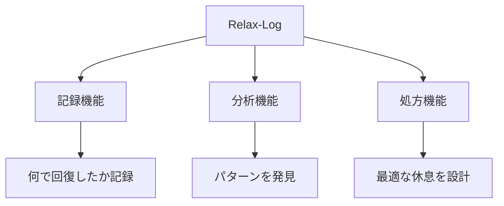

# 付録B：Relax-Logテンプレート

## Relax-Log（リラログ）とは

**Relax-Log**は、あなたが「何で回復するか」を記録し、Vacuin（空隙素）を意図的かつ安全に摂取するための個人カルテです。無意識の「ダラダラ」を、意識的な「回復の食物繊維」に変換します。

### Relax-Logの3つの機能



## 基本テンプレート

### デイリーRelax-Log

```markdown
## [日付] Relax-Log

### 今日のVacuin摂取記録

| 時間 | 活動 | 時間 | 回復度 | メモ |
| :--- | :--- | :--- | :--- | :--- |
| 例：12:30 | SNSスクロール | 15分 | ★★☆☆☆ | 疲れた |
| 例：15:00 | 散歩 | 20分 | ★★★★☆ | スッキリ |
|  |  |  | ☆☆☆☆☆ |  |
|  |  |  | ☆☆☆☆☆ |  |
|  |  |  | ☆☆☆☆☆ |  |

### 効果的だったVacuin TOP3
1. 
2. 
3. 

### 逆効果だった（Toxin化した）もの
- 

### 明日試したいVacuin
- 
```

## 週間分析テンプレート

### ウィークリーRelax-Log分析

```markdown
## 週間Vacuin分析（　月　日〜　月　日）

### 回復効果ランキング

| 順位 | 活動 | 平均回復度 | 最適時間 | 頻度 |
| :--- | :--- | :--- | :--- | :--- |
| 1位 |  | ★★★★★ | 分 | 回/週 |
| 2位 |  | ★★★★☆ | 分 | 回/週 |
| 3位 |  | ★★★☆☆ | 分 | 回/週 |

### 時間帯別ベストVacuin

| 時間帯 | 最も効果的なVacuin | 理由 |
| :--- | :--- | :--- |
| 朝（6-9時） |  |  |
| 午前（9-12時） |  |  |
| 昼（12-15時） |  |  |
| 午後（15-18時） |  |  |
| 夜（18-21時） |  |  |
| 深夜（21時-） |  |  |

### 発見したパターン
- 
- 

### 来週の実験
- 新しく試すVacuin：
- 減らすVacuin：
- 時間を変えるVacuin：
```

## カテゴリ別Vacuinリスト

### あなたのVacuinライブラリ

```markdown
## 私のVacuinライブラリ

### 身体系Vacuin
- [ ] 散歩（効果：★★★★☆）最適：15-20分
- [ ] ストレッチ（効果：★★★☆☆）最適：5-10分
- [ ] 昼寝（効果：★★★★★）最適：20分
- [ ] 
- [ ] 

### 感覚系Vacuin
- [ ] 音楽鑑賞（効果：★★★★☆）最適：1-3曲
- [ ] アロマ（効果：★★★☆☆）最適：継続
- [ ] 
- [ ] 

### デジタル系Vacuin
- [ ] 動画視聴（効果：★★★☆☆）最適：10-20分
- [ ] ゲーム（効果：★★☆☆☆）最適：15分まで
- [ ] 
- [ ] 

### 社交系Vacuin
- [ ] 雑談（効果：★★★★☆）最適：10-15分
- [ ] メッセージ（効果：★★☆☆☆）最適：5分
- [ ] 
- [ ] 

### 創造系Vacuin
- [ ] 落書き（効果：★★★★☆）最適：10分
- [ ] 料理（効果：★★★★★）最適：30-60分
- [ ] 
- [ ] 

### 無為系Vacuin
- [ ] ぼーっとする（効果：★★★★★）最適：5-10分
- [ ] 窓の外を眺める（効果：★★★★☆）最適：3-5分
- [ ] 
- [ ] 
```

## 状況別Vacuin処方箋

### 症状別おすすめVacuin

| 症状 | 処方Vacuin | 摂取量 | 注意事項 |
| :--- | :--- | :--- | :--- |
| **頭が重い** | 散歩＋深呼吸 | 15分 | 外気に触れる |
| **目が疲れた** | 遠くを見る＋目を閉じる | 5分×3回 | 画面は見ない |
| **イライラ** | 激しめの運動 | 10分 | 汗をかく程度 |
| **やる気が出ない** | 好きな音楽＋軽い体操 | 10分 | リズムに乗る |
| **集中力切れ** | 場所移動＋水分補給 | 5分 | 環境を変える |
| **不安感** | 瞑想＋ジャーナリング | 15分 | 感情を書き出す |
| **孤独感** | 友人にメッセージ | 10分 | 深い話は避ける |

## Vacuin効果測定シート

### 実験的Vacuin評価表

```markdown
## 新Vacuin実験記録

### 基本情報
- Vacuin名：
- カテゴリ：
- 実施日時：
- 継続時間：

### 実施前の状態
- 身体疲労度（1-10）：
- 精神疲労度（1-10）：
- 期待度（1-10）：

### 実施中の観察
- 楽しさ（1-10）：
- 没入度（1-10）：
- 身体感覚：

### 実施後の状態
- 身体回復度（1-10）：
- 精神回復度（1-10）：
- 満足度（1-10）：

### 総合評価
- 回復効果：★☆☆☆☆
- 再実施意向：Yes / No
- 最適時間：＿分
- 最適タイミング：

### メモ
- 良かった点：
- 改善点：
- Toxin化のリスク：
```

## 月間Relax-Log集計

### マンスリーレポート

```markdown
## [　年　月] Relax-Log月次レポート

### 統計データ
- 総Vacuin摂取時間：＿時間
- 1日平均：＿分
- 最多摂取日：　月　日（＿分）
- 最少摂取日：　月　日（＿分）

### TOP5 Vacuin
1. ＿＿＿＿（計＿回、平均効果★★★★☆）
2. ＿＿＿＿（計＿回、平均効果★★★☆☆）
3. ＿＿＿＿（計＿回、平均効果★★★☆☆）
4. ＿＿＿＿（計＿回、平均効果★★☆☆☆）
5. ＿＿＿＿（計＿回、平均効果★★☆☆☆）

### Toxin化したVacuin
- ＿＿＿＿（理由：過剰摂取）
- ＿＿＿＿（理由：タイミング不適切）

### 新規開拓Vacuin
- 試した数：＿個
- 定着した数：＿個
- 最も効果的だった新Vacuin：

### 来月への申し送り
- 継続すべきVacuin：
- 削減すべきVacuin：
- 新たに試すVacuin：
```

## Vacuinと他の栄養素のバランス記録

### 1日の栄養バランスログ

```markdown
## [日付] 時間栄養バランス

### 時間配分円グラフ用データ
- Essentin：＿時間（＿%）
- Vacuin：＿時間（＿%）
- Toxin：＿時間（＿%）
- その他（睡眠等）：＿時間（＿%）

### Vacuinの質
- 計画的Vacuin：＿時間
- 衝動的Vacuin：＿時間
- 意図的配置率：＿%

### 理想との差分
- 理想のVacuin：40%
- 実際のVacuin：＿%
- 調整方針：増やす / 減らす / 維持
```

## 緊急時Vacuin処方

### SOS時の即効Vacuinリスト

```markdown
## 緊急Vacuinリスト（印刷して手元に）

### 3分以内で効くVacuin
1. 深呼吸10回
2. 冷たい水を飲む
3. 顔を洗う
4. 外の空気を吸う
5. 好きな写真を見る

### 5分で効くVacuin
1. 好きな曲を1曲
2. 軽いストレッチ
3. ペットの動画
4. チョコレートを味わう
5. 誰かに「疲れた」とLINE

### 10分で効くVacuin
1. 散歩
2. シャワー
3. 瞑想アプリ
4. 日記を書く
5. 部屋の片付け

※上記はサンプルです。あなた専用のリストを作成してください。

```

## Relax-Log活用のコツ

### 記録を続けるための工夫

| 工夫 | 具体的方法 | 効果 |
| :--- | :--- | :--- |
| **簡略化** | 絵文字だけで記録 | 継続率80%向上 |
| **定時化** | 毎日21時に記入 | 習慣化しやすい |
| **可視化** | カレンダーに★印 | モチベーション維持 |
| **共有** | 友人と交換 | 新しいVacuin発見 |
| **ゲーム化** | ポイント制導入 | 楽しみながら継続 |

***
