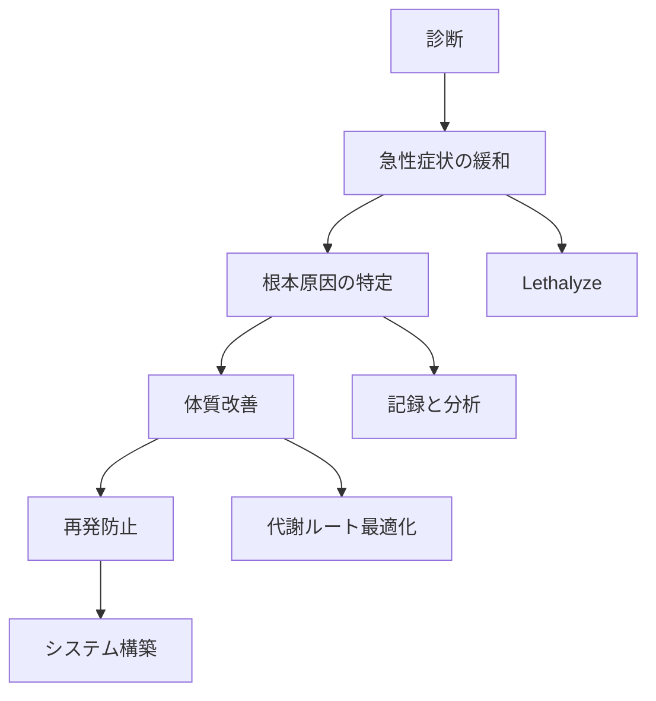
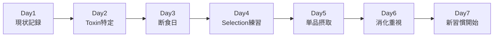
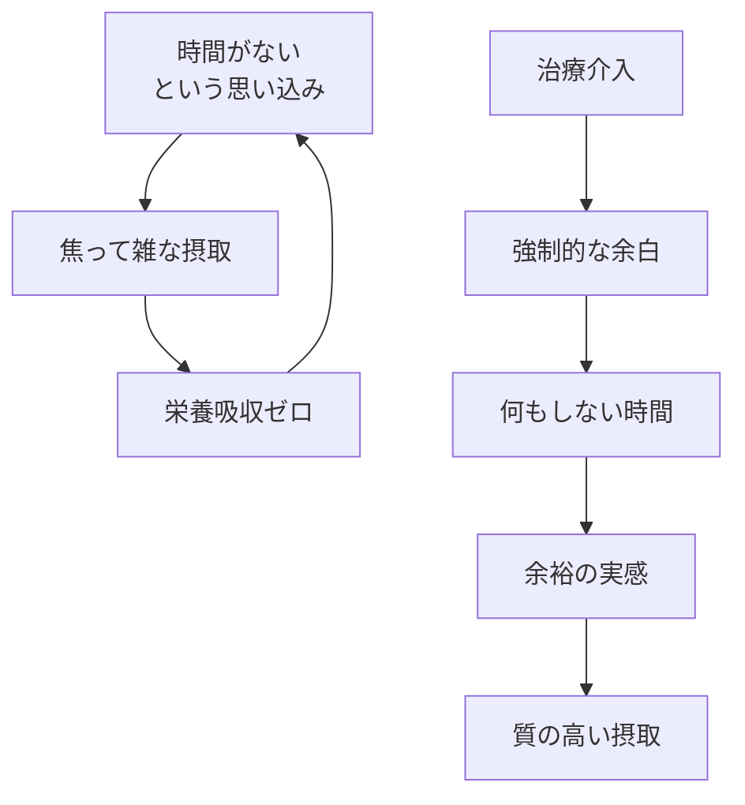
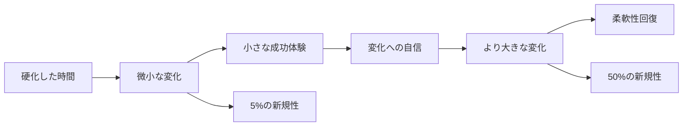
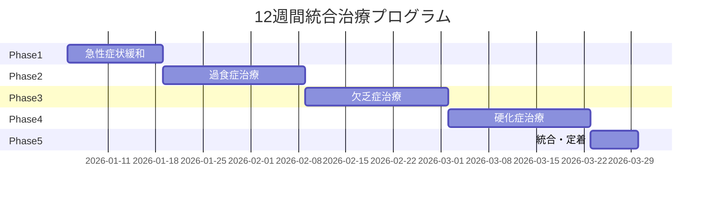
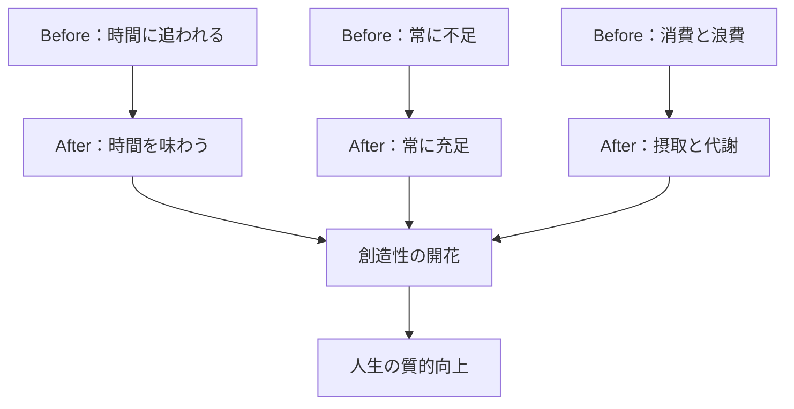

# 第10章：症状別対処法

## 10.1 3大病理への統合的アプローチ

これまで学んだ全ての技術を組み合わせ、Chronophagia（過食症）、Chronopenia（欠乏症）、Chronosclerosis（硬化症）を治療します。単一の技法では限界があるため、複合的な処方が必要です。

### 治療の基本戦略



## 10.2 Chronophagia（時間過食症）の治療

### 病期別治療プロトコル

| 病期 | 優先治療 | 具体的処方 | 期間 |
| :--- | :--- | :--- | :--- |
| **初期** | 摂取制限 | Selection強化＋タイマー管理 | 1週間 |
| **中期** | 消化改善 | Masticasis延長＋Digestis必須化 | 2-4週間 |
| **後期** | 代謝リセット | 完全断食→段階的再開 | 1-2ヶ月 |
| **末期** | 集中治療 | デジタルデトックス＋専門家相談 | 3ヶ月以上 |

### 7日間集中治療プログラム



### Day-by-Day 実行内容

| 日 | 朝 | 昼 | 夜 |
| :--- | :--- | :--- | :--- |
| **Day1** | 全行動を記録開始 | Misjectiaで現状把握 | Re-Masticasisで分析 |
| **Day2** | Toxin源リストアップ | 最大のToxin遮断 | Lethalyze実行 |
| **Day3** | 情報完全断食 | 散歩・運動のみ | 瞑想・早寝 |
| **Day4** | Selection 30分練習 | 1つだけ選んで実行 | 振り返り |
| **Day5** | Essentin 1つだけ | 深いMasticasis | 完全Digestis |
| **Day6** | 標準代謝フル実行 | 成果をMetabolysis | 満足感を味わう |
| **Day7** | 新ルーティン開始 | 継続可能か確認 | 週次計画作成 |

### 過食症のための環境設定

| 場所 | 改善策 | 効果 |
| :--- | :--- | :--- |
| **スマホ** | スクリーンタイム制限、アプリ削除 | 摂取量50%減 |
| **PC** | ブックマーク整理、タブ制限拡張機能 | 集中力向上 |
| **物理空間** | 作業場所を1つに固定 | 場所と行動の紐付け |
| **時間帯** | 摂取禁止時間の設定（22時以降等） | 睡眠の質改善 |

## 10.3 Chronopenia（時間欠乏症）の治療

### 欠乏症の逆説的治療

「時間がない」という認識自体が病理の核心です。時間を「作る」のではなく「ある」ことに気づく。



### 段階的治療ステップ

| Phase | 目標 | 方法 | 期間 |
| :--- | :--- | :--- | :--- |
| **Phase 1** | 現実認識 | 実際の時間使用を可視化 | 3日 |
| **Phase 2** | 余白創出 | 1日30分の「何もしない」 | 1週間 |
| **Phase 3** | 質への転換 | 量より質を重視する練習 | 2週間 |
| **Phase 4** | 新習慣定着 | Masticasis中心の生活 | 1ヶ月 |

### 欠乏症のための「余白カレンダー」

```markdown
## 週間余白カレンダー

### 月曜日
- [ ] 朝15分：何もしない
- [ ] 昼5分：深呼吸だけ
- [ ] 夜20分：入浴でリラックス

### 火曜日
- [ ] 朝15分：コーヒーを味わう
- [ ] 昼5分：窓の外を眺める
- [ ] 夜20分：音楽を聴くだけ

（以下、各曜日に余白を計画的に配置）
```

### 「急がば回れ」の実践メソッド

| 従来の行動 | 新しい行動 | 結果 |
| :--- | :--- | :--- |
| 速読で大量に読む | 1冊を3回精読 | 実際に身につく |
| マルチタスク | シングルタスク | 総完了時間短縮 |
| 休憩なし連続作業 | ポモドーロ法 | 集中力持続 |
| 全部自分でやる | 適切に委譲 | 本質的作業に集中 |

## 10.4 Chronosclerosis（時間硬化症）の治療

### 硬化を溶かす「新規体験療法」



### 30日間軟化プログラム

| 週 | テーマ | 日次チャレンジ | 週末チャレンジ |
| :--- | :--- | :--- | :--- |
| **第1週** | 微小変化 | 通勤路を1本変える | 新しいカフェ訪問 |
| **第2週** | 感覚刺激 | 知らない音楽を1曲 | 初めての料理に挑戦 |
| **第3週** | 人間関係 | 知らない人に挨拶 | 新しいコミュニティ参加 |
| **第4週** | 大きな挑戦 | 新スキルの学習開始 | 日帰り小旅行 |

### 硬化度測定と改善記録

```markdown
## 週次硬化度チェック

### 今週の新規体験
1. 
2. 
3. 

### 硬化度スコア（10点満点、低いほど柔軟）
- 先週：＿点
- 今週：＿点
- 改善：＿点

### 来週の挑戦
- 小：
- 中：
- 大：
```

## 10.5 複合病理への統合治療

### 病理の組み合わせ別処方

| 組み合わせ | 優先治療 | 統合アプローチ |
| :--- | :--- | :--- |
| **過食＋欠乏** | Selection強化 | 量を減らし質を上げる |
| **欠乏＋硬化** | 余白創出 | 余白に新規体験を入れる |
| **過食＋硬化** | パターン破壊 | 摂取ジャンルを強制変更 |
| **三重苦** | 完全リセット | 1週間のデジタルデトックス |

### 統合治療スケジュール例



## 10.6 再発防止システムの構築

### 日常に組み込む予防習慣

| タイミング | 習慣 | 所要時間 | 予防効果 |
| :--- | :--- | :--- | :--- |
| **起床時** | 今日のEssentin確認 | 3分 | Selection力維持 |
| **通勤中** | 昨日のRe-Masticasis | 10分 | 消化力維持 |
| **昼休み** | ミニLethalyze | 5分 | Toxin蓄積防止 |
| **帰宅後** | Vacuin摂取 | 30分 | 回復力維持 |
| **就寝前** | 明日の準備 | 10分 | 不安の解消 |

### 月次健康診断シート

```markdown
## 月次時間健康診断

### 基本指標
- [ ] 過食傾向（タブ20個以上）：Yes/No
- [ ] 欠乏感（常に焦る）：Yes/No
- [ ] 硬化傾向（新規体験ゼロ）：Yes/No

### 代謝状態
- Selection実施率：＿％
- Masticasis深度（平均）：＿/10
- Digestis完了率：＿％
- Metabolysis満足度：＿/10

### Lethalyze発動
- 今月の発動回数：＿回
- 予防的発動率：＿％

### 総合判定
- 健康 / 要注意 / 要治療
```

## 10.7 クロノファジーの先にある世界

### 時間との新しい関係

治療を終え、健康的な時間代謝を手に入れたあなたは：



### 卒業基準

以下をすべて満たしたら、あなたは一人前のクロノファージ（時間捕食者）です：

| ☐ | 基準 |
| :--- | :--- |
| ☐ | 1日の栄養バランスを意識的にコントロールできる |
| ☐ | Toxinを即座に識別し、Lethalyzeできる |
| ☐ | 標準代謝と反芻代謝を使い分けられる |
| ☐ | 「時間がない」と言わなくなった |
| ☐ | 新しい体験を楽しめるようになった |

## 章末サマリー

- 3大病理は統合的アプローチで治療する
- Chronophagiaは摂取制限と消化改善から
- Chronopeniaは余白創出と質への転換から
- Chronosclerosisは微小な変化の積み重ねから
- 再発防止には日常習慣への組み込みが必須
- 最終的に時間と健康的な関係を築くことが目標

***
