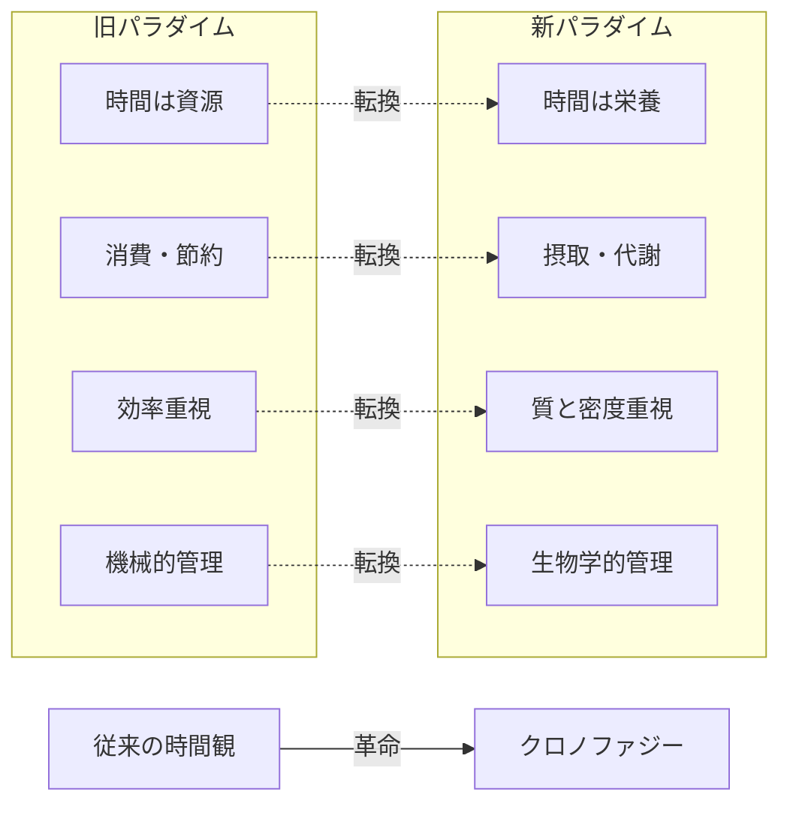
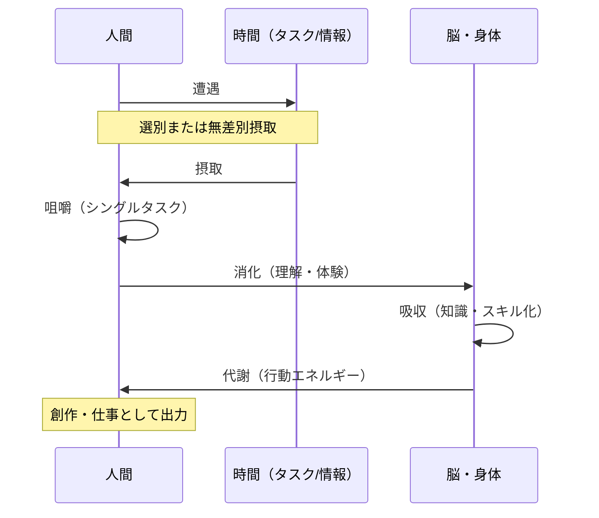
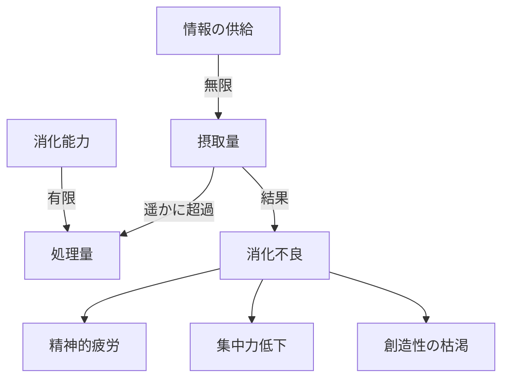

# 第1章：クロノファジーとは何か

## 1.1 従来の時間観からの脱却

私たちは長い間、「時は金なり」という産業革命以来の価値観に支配されてきました。時間を「資源」として捉え、いかに効率的に「消費」するかに腐心してきたのです。

しかし、この機械的な時間観は、現代において深刻な問題を引き起こしています。常に「時間が足りない」と焦り、情報を詰め込み、結果として精神的な消化不良を起こす──これが現代人の慢性的な症状です。

**クロノファジー（Chronophagy）**は、この問題に対する革命的なアプローチです。

## 1.2 クロノファジーの基本概念

### 定義テーブル

| 項目 | 内容 |
| :--- | :--- |
| **名称** | Chronophagy（クロノファジー） |
| **語源** | Chrono（時間）＋ Phagy（食べる） |
| **日本語** | 時間捕食術 |
| **核心理念** | 時間を「消費する資源」ではなく「摂取する栄養」として扱う |
| **標語** | 「時は金なり」→「**時はカロリーなり**」 |

## 1.3 パラダイムシフトの構造

## 1.4 時間代謝の基本メカニズム

人間が食物を摂取し、消化・吸収・代謝するように、時間も同じプロセスを経て「血肉」となります。

### 代謝プロセス概要

## 1.5 Caloria（カロリア）：時間の質を測る単位

物理的な「時間の長さ（分・時間）」と、実際に得られる「栄養価」は必ずしも一致しません。

### Caloriaの特性

| 特性 | 説明 | 例 |
| :--- | :--- | :--- |
| **密度依存** | 同じ1時間でも、集中度により栄養価が変化 | 没入した1時間 ＞ ながら作業の3時間 |
| **個人差** | 同じ活動でも、人により栄養価が異なる | Aさんにとっての読書 ≠ Bさんにとっての読書 |
| **時間帯変動** | 同じ人でも、時間帯により吸収率が変化 | 朝の学習 vs 深夜の学習 |
| **相互作用** | 前後の活動により、栄養価が増減する | 運動後の創作活動は高Caloria |

## 1.6 なぜ今、クロノファジーが必要なのか

現代は「情報過食の時代」です。スマートフォン、SNS、動画配信──無限の情報が24時間、私たちの口元に運ばれてきます。

しかし、私たちの「消化能力」は有限です。

### 現代人の時間摂取状況

**クロノファジー**は、この状況に対する「食事療法」です。何を食べ、どう噛み、いかに消化するか──時間の栄養学を確立することで、現代を健康的に生きる術を提供します。

## 章末サマリー

- 時間は「消費する資源」ではなく「摂取する栄養」である
- 物理的な時間の長さと、得られる栄養価（Caloria）は別物
- 現代は情報過食の時代であり、消化不良が蔓延している
- クロノファジーは、時間の健康的な代謝を実現する技術体系

***
