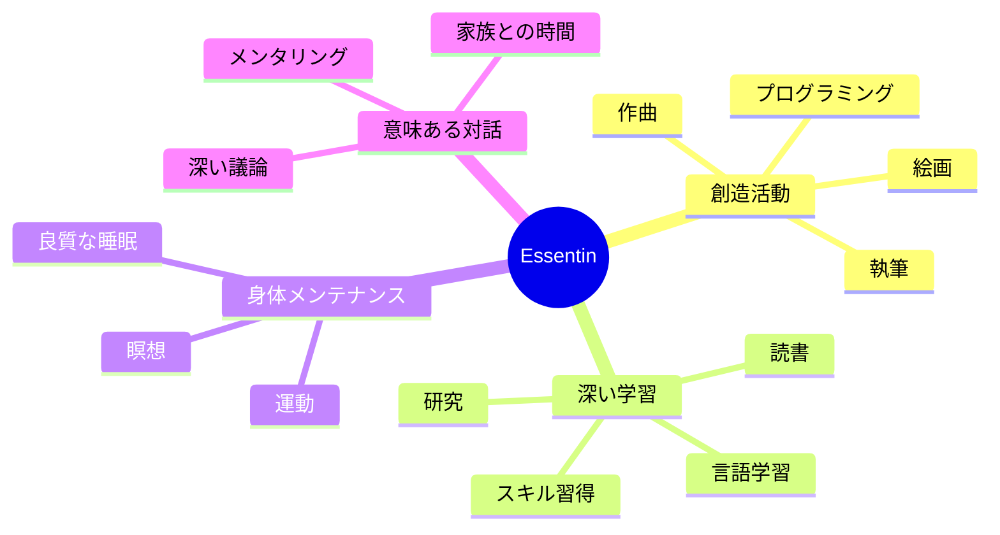
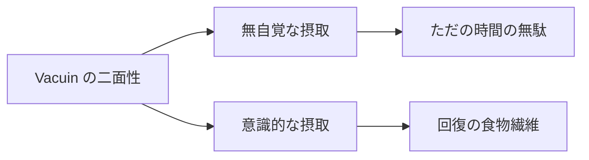
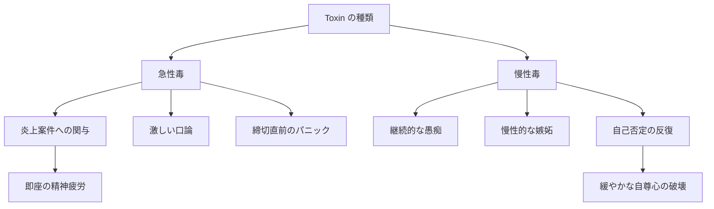
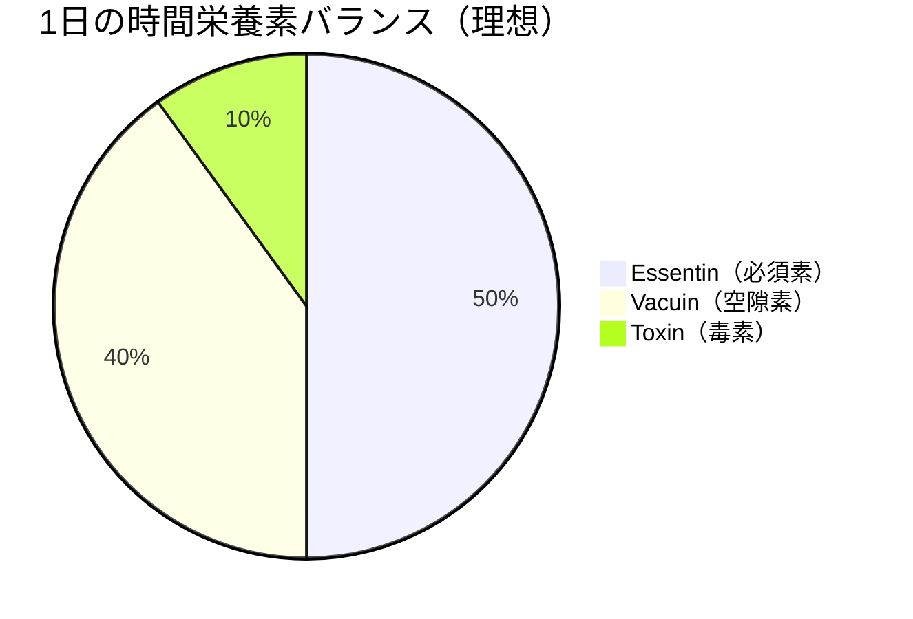
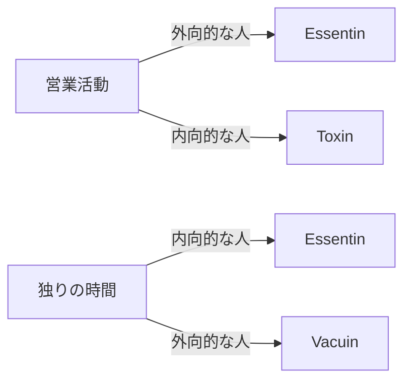

# 第2章：時間の3大栄養素

## 2.1 時間にも栄養素がある

食物に炭水化物・タンパク質・脂質があるように、時間にも3つの基本栄養素が存在します。これらを正しく識別し、適切なバランスで摂取することが、健康的な時間代謝の基盤となります。

## 2.2 3大栄養素の定義

### 栄養素分類テーブル

| 栄養素名 | 読み | 性質 | 役割 | 摂取推奨度 |
| :--- | :--- | :--- | :--- | :--- |
| **Essentin** | エッセンチン | 必須素 | 生命維持・成長に不可欠な高密度時間 | **必須**（毎日摂取） |
| **Vacuin** | バキュイン | 空隙素 | 脳の休息・緩衝材となる低密度時間 | **適量**（意識的に配置） |
| **Toxin** | トキシン | 毒素 | 精神を蝕む有害時間 | **回避**（可能な限り排除） |

## 2.3 Essentin（エッセンチン／必須素）

### 定義と特徴

**Essentin**は、人間の成長と創造性の維持に不可欠な「必須時間栄養素」です。ビタミンやミネラルのように、欠乏すると精神的・知的な欠乏症を引き起こします。

### Essentin の具体例

### Essentin の特性

| 特性 | 説明 |
| :--- | :--- |
| **高Caloria** | 短時間でも濃密な栄養を含む |
| **成長促進** | 新しい能力・視点を獲得できる |
| **持続効果** | 一度摂取すると長期間効果が持続 |
| **個人特異性** | 人により「何がEssentin か」は異なる |

## 2.4 Vacuin（バキュイン／空隙素）

### 定義と特徴

**Vacuin**は一見「空虚」に見える時間ですが、適切に摂取すれば脳の回復と次の活動への準備を促す「食物繊維」のような存在として機能します。

### 重要な認識転換

### Vacuin の具体例と効能

| 活動例 | 無自覚な場合 | 意識的な場合の効能 |
| :--- | :--- | :--- |
| SNSスクロール | 時間泥棒 | トレンド把握・軽い刺激補給 |
| 動画視聴 | だらだら消費 | 気分転換・笑いによるストレス解消 |
| ゲーム | 現実逃避 | 達成感の補給・反射神経の維持 |
| 昼寝 | サボり | 脳のデフラグ・午後の生産性向上 |
| 散歩 | 時間つぶし | アイデアの熟成・血流改善 |

## 2.5 Toxin（トキシン／毒素）

### 定義と特徴

**Toxin**は摂取すると精神的・身体的な炎症を引き起こす有害な時間です。食中毒のように、即座に症状が出る場合と、蓄積により慢性症状を引き起こす場合があります。

### Toxin の分類と症状

### Toxin への対処法

| 対処段階 | 方法 | 具体例 |
| :--- | :--- | :--- |
| **予防** | 毒源の特定と回避 | 特定のSNSアカウントをミュート |
| **遮断** | 摂取の即座停止 | 議論が過熱したら席を立つ |
| **解毒** | Lethalyze の発動 | 毒素を分解し無害化（第4章で詳述） |
| **回復** | Essentin での中和 | 創造活動で心を浄化 |

## 2.6 栄養バランスの重要性

### 理想的な摂取バランス

注：Toxin を完全にゼロにすることは現実的に不可能なため、最小限に抑えつつ適切に処理することが重要。上記は理想バランスの一例であり、個人差により Essentin 40-50%、Vacuin 40-50%、Toxin 10%以下の範囲で調整が望ましい。

### バランス崩壊パターン

| パターン | 状態 | 結果 |
| :--- | :--- | :--- |
| Essentin 過多 | 必須素ばかりで休息なし | 燃え尽き症候群 |
| Vacuin 過多 | 空隙素ばかりでメリハリなし | 慢性的な無気力 |
| Toxin 過多 | 毒素の蓄積 | 精神的炎症・鬱症状 |

## 2.7 個人カスタマイズの必要性

### 栄養素の個人差

同じ活動でも、人により栄養素分類は変わります：

## 章末サマリー

- 時間には3つの栄養素がある：Essentin（必須）、Vacuin（空隙）、Toxin（毒）
- Vacuin は意識的に摂取すれば回復の食物繊維として機能する
- Toxin は最小限に抑え、適切に処理する必要がある
- 栄養素の分類は個人により異なるため、自己観察が重要

***
