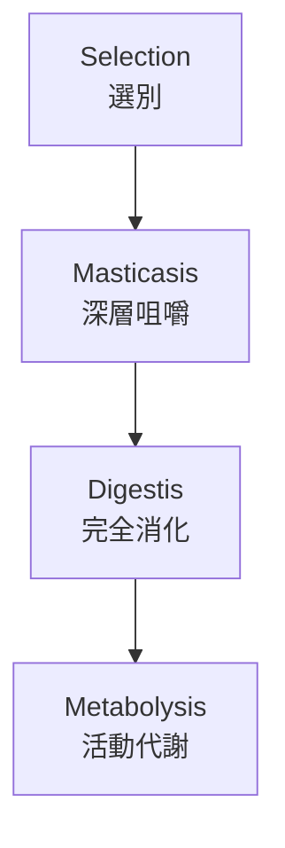
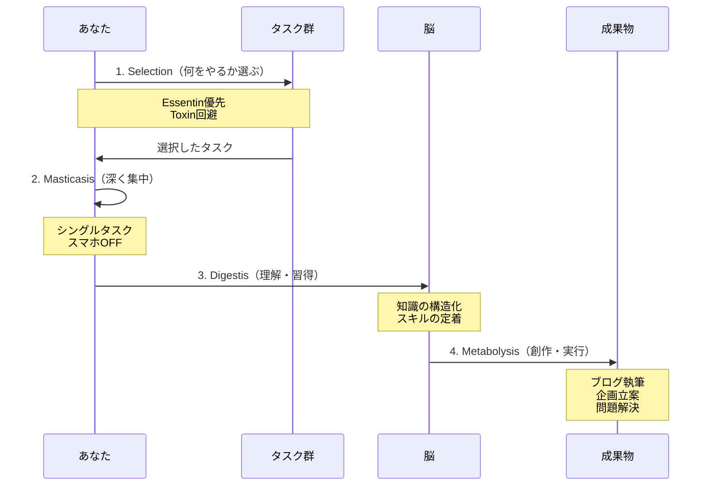
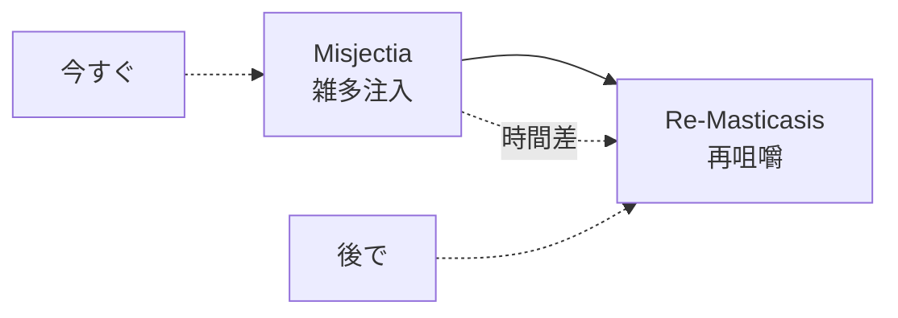
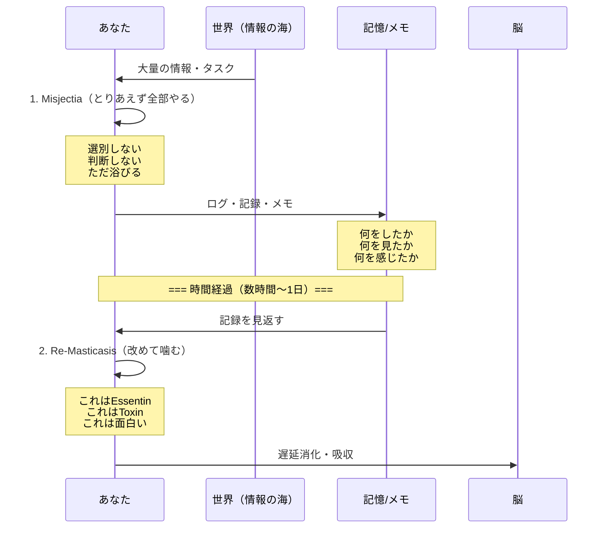
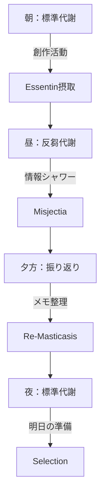
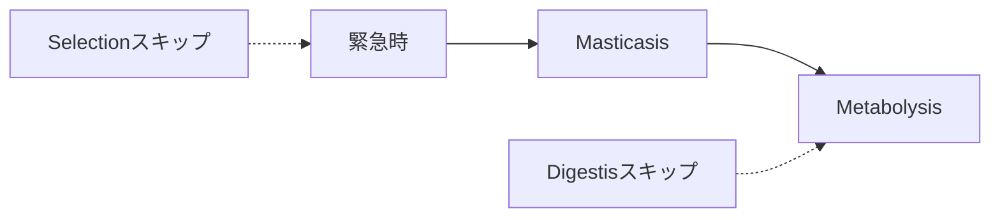

# 第3章：2つの代謝ルート

## 3.1 時間代謝の2つのアプローチ

食事に「よく噛んで食べる」方法と「とりあえず飲み込んで後で消化する」方法があるように、時間の代謝にも2つの基本ルートが存在します。

### 代謝ルート比較表

| 項目 | 標準代謝ルート | 反芻代謝ルート |
| :--- | :--- | :--- |
| **開始点** | Selection（選別） | Misjectia（雑多注入） |
| **特徴** | 慎重・計画的 | 即応的・柔軟 |
| **段階数** | 4段階 | 2段階 |
| **適した状況** | 余裕がある時 | 忙しい時・探索時 |
| **必要スキル** | 事前判断力 | 事後処理力 |

## 3.2 標準代謝ルート（4段階プロセス）

### プロセス全体図

### 各段階の詳細定義

| 段階 | 名称 | 読み | 機能 | 生物学的対応 |
| :--- | :--- | :--- | :--- | :--- |
| **1** | Selection | セレクション | 摂取する時間の質を見極める | 食材選び |
| **2** | Masticasis | マスティカシス | シングルタスクで深く没入する | 咀嚼 |
| **3** | Digestis | ダイジェスティス | 体験を知識・スキルに変換する | 消化・吸収 |
| **4** | Metabolysis | メタボリシス | 得た栄養を行動として出力する | 代謝・燃焼 |

### 標準代謝の動作シーケンス

### 各段階の所要時間目安

| 段階 | 時間配分 | 備考 |
| :--- | :--- | :--- |
| Selection | 5-10分 | 長すぎると決定疲れ |
| Masticasis | 25-90分 | ポモドーロ法との相性良好 |
| Digestis | 10-30分 | 振り返りと整理 |
| Metabolysis | 30-120分 | アウトプットの時間 |

## 3.3 反芻代謝ルート（2段階プロセス）

### プロセス全体図

### 各段階の詳細定義

| 段階 | 名称 | 読み | 機能 | 特徴 |
| :--- | :--- | :--- | :--- | :--- |
| **1** | Misjectia | ミスジェクティア | 選別せず手当たり次第に情報を注入 | スピード重視・雑多OK |
| **2** | Re-Masticasis | リ・マスティカシス | 後から取り出して噛み直す | メモ必須・振り返り |

### 反芻代謝の動作シーケンス

## 3.4 2つのルートの使い分け

### 状況別の選択指針

| 状況 | 推奨ルート | 理由 |
| :--- | :--- | :--- |
| 朝の計画的な学習 | 標準代謝 | 頭が冴えていて選別能力が高い |
| 情報収集フェーズ | 反芻代謝 | 何が重要か事前に分からない |
| 締切のあるプロジェクト | 標準代謝 | 無駄な時間を削る必要がある |
| 新分野の探索 | 反芻代謝 | 判断基準がまだない |
| ルーティンワーク | 標準代謝 | やることが明確 |
| SNS・ネットサーフィン | 反芻代謝 | 選別すると楽しくない |

## 3.5 ハイブリッド運用

実際には、2つのルートを組み合わせて使うことが最も効果的です。

### 1日の中でのルート切り替え例

## 3.6 反芻代謝の注意点

### リスクと対策

| リスク      | 症状              | 対策                   |
| :------- | :-------------- | :------------------- |
| **消化忘れ** | Misjectiaだけで終わる | 必ず当日中にRe-Masticasis  |
| **毒素蓄積** | Toxinを大量摂取      | Lethalyze（リーサライズ）を併用 |
| **記録不足** | 何をしたか忘れる        | リアルタイムメモの習慣化         |

### 反芻を成功させる3つのコツ

1. **即座メモ**：体験した瞬間に最小限のメモを残す
2. **定時振り返り**：毎日決まった時間にRe-Masticasisを行う
3. **感情タグ**：「面白い」「疲れた」など感情も記録する

## 3.7 プロセスの省略と拡張

### 省略パターン

緊急時は「とりあえず集中して、すぐアウトプット」も可能。ただし後で必ず補完する。

### 拡張パターン

標準代謝の各段階を2回繰り返す「二度噛み」や、複数の素材を同時にMasticasisする「並行咀嚼」など、熟練者向けの応用も存在。

## 章末サマリー

- 時間代謝には「標準代謝」と「反芻代謝」の2ルートがある
- 標準代謝は4段階で慎重に、反芻代謝は2段階で素早く処理
- 状況に応じて使い分け、時にはハイブリッド運用が効果的
- 反芻代謝では必ず「後で噛む」工程を忘れずに

***
