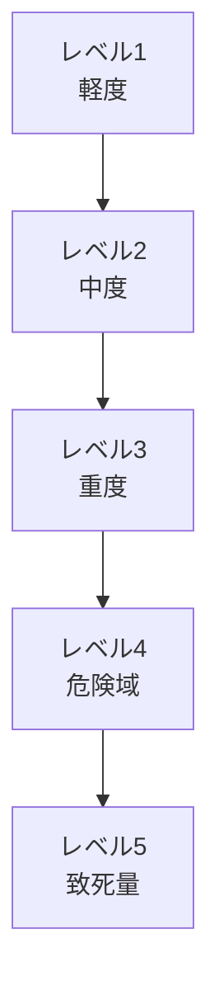
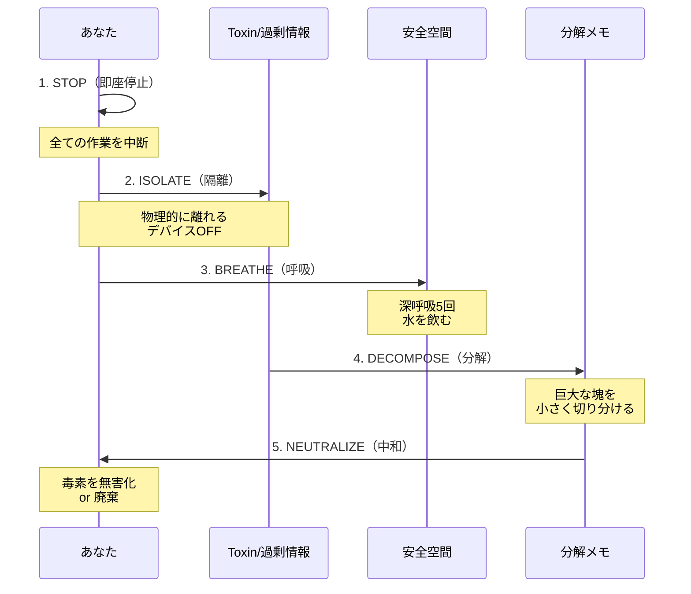
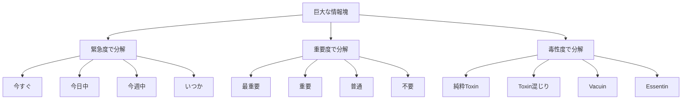
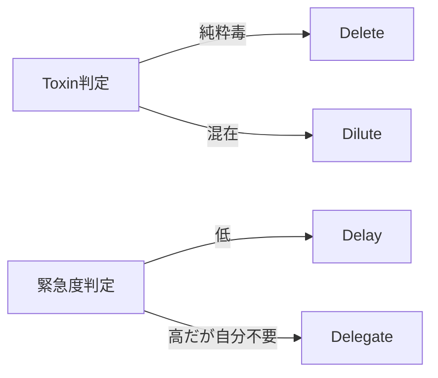
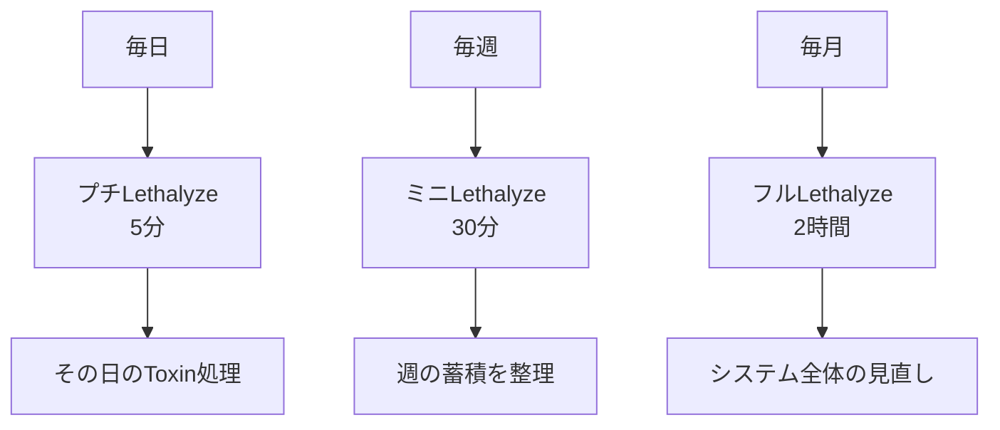

# 第4章：緊急処置システム

## 4.1 Lethalyze（リーサライズ）とは

情報の暴食により「致死量」に達した時、緊急的に発動する解毒・分解システムが**Lethalyze（リーサライズ）** です。食中毒に対する胃洗浄や解毒剤投与のように、有害な時間栄養素を強制的に分解・排出します。

### 基本定義

| 項目 | 内容 |
| :--- | :--- |
| **名称** | Lethalyze（リーサライズ） |
| **語源** | Lethal（致死）＋ -lyze（分解・溶解） |
| **機能** | 致死量の情報・ストレスを処理可能なサイズに分解 |
| **医学的対応** | 解毒剤投与・胃洗浄・透析 |
| **発動タイミング** | 精神的・身体的限界の直前 |

## 4.2 致死量のサイン

### 危険信号の段階

### 症状レベル表

| レベル | 身体症状 | 精神症状 | 行動症状 |
| :--- | :--- | :--- | :--- |
| **1：軽度** | 目の疲れ | 軽い焦り | 集中力の揺らぎ |
| **2：中度** | 肩こり・頭重感 | イライラ | タスクの切り替え困難 |
| **3：重度** | 頭痛・吐き気 | 思考の混乱 | ミスの増加 |
| **4：危険域** | 動悸・めまい | パニック状態 | 判断力の喪失 |
| **5：致死量** | 過呼吸・失神リスク | 解離・現実感喪失 | 完全なフリーズ |

**Lethalyzeはレベル3〜4で発動すべき**。レベル5まで待つと手遅れになる。

## 4.3 Lethalyzeの実行プロセス

### 5段階の緊急処置

### 各段階の詳細

| 段階 | アクション | 具体的行動 | 所要時間 |
| :--- | :--- | :--- | :--- |
| **1. STOP** | 即座停止 | 手を止める、画面を閉じる | 3秒 |
| **2. ISOLATE** | 物理的隔離 | 部屋を出る、スマホを置く | 30秒 |
| **3. BREATHE** | 生理的安定 | 深呼吸、水分補給、軽いストレッチ | 3分 |
| **4. DECOMPOSE** | 情報の分解 | 紙に書き出し、カテゴリ分け | 10分 |
| **5. NEUTRALIZE** | 毒性の中和 | 削除・委譲・延期の判断 | 10分 |

## 4.4 分解（DECOMPOSE）の技法

### 分解マトリクス

致死量の情報塊を、以下の軸で切り分けます：

### 分解記録テンプレート

| 項目 | 緊急度 | 重要度 | 毒性 | 処理方法 |
| :--- | :--- | :--- | :--- | :--- |
| 例：炎上メール対応 | 高 | 低 | Toxin | 定型文で最小限対応 |
| 例：締切間近の仕事 | 高 | 高 | 混在 | Essentin部分のみ抽出 |
| 例：SNSの通知100件 | 低 | 低 | Vacuin | 全て既読スルー |

## 4.5 中和（NEUTRALIZE）の戦略

### 4つの中和オプション

| 戦略 | 記号 | 説明 | 適用例 |
| :--- | :--- | :--- | :--- |
| **Delete** | 🗑️ | 完全削除 | 無意味な議論、スパムメール |
| **Delegate** | 👥 | 他者へ委譲 | 自分でなくてもできる作業 |
| **Delay** | ⏰ | 延期 | 重要だが緊急でないタスク |
| **Dilute** | 💧 | 希釈 | 15分の作業を3日に分けて5分ずつ |

### 中和の優先順位

## 4.6 Lethalyze後のアフターケア

### 回復プロトコル

緊急処置後は、必ず以下の回復プロセスを実行：

| 段階 | 行動 | 目的 |
| :--- | :--- | :--- |
| **1. 小休憩** | 15分の完全休息 | 神経系の鎮静 |
| **2. Vacuin摂取** | 軽い娯楽・散歩 | 緩やかな刺激で回復 |
| **3. 振り返り** | 致死量に至った原因分析 | 再発防止 |
| **4. 予防策** | ルール・仕組みの改善 | システム的対策 |

## 4.7 予防的Lethalyze

### プリエンプティブ（先制的）分解

致死量に達する前に、定期的に小規模なLethalyzeを実行：

### デイリー・プチLethalyzeの手順

1. **夜のルーティンに組み込む**（寝る前30分）
2. **今日のToxinをリストアップ**（3分）
3. **Delete/Delay判定**（2分）
4. **明日に持ち越さない**

## 4.8 Lethalyzeの失敗パターン

### よくある失敗と対策

| 失敗パターン | 原因 | 対策 |
| :--- | :--- | :--- |
| **不完全停止** | 「あと少し」の誘惑 | タイマーで強制終了 |
| **隔離不足** | スマホを持ったまま | 別の部屋に置く |
| **分解の先延ばし** | 「後でやる」 | その場で紙に書く |
| **全部重要病** | 何も捨てられない | 「死ぬわけじゃない」と唱える |

## 章末サマリー

- Lethalyzeは致死量の情報を分解する緊急処置システム
- レベル3〜4の症状で発動（レベル5は手遅れ）
- STOP→ISOLATE→BREATHE→DECOMPOSE→NEUTRALIZEの5段階
- 予防的に小規模なLethalyzeを定期実行することが重要
- 失敗パターンを知り、確実に実行する仕組みを作る

***
