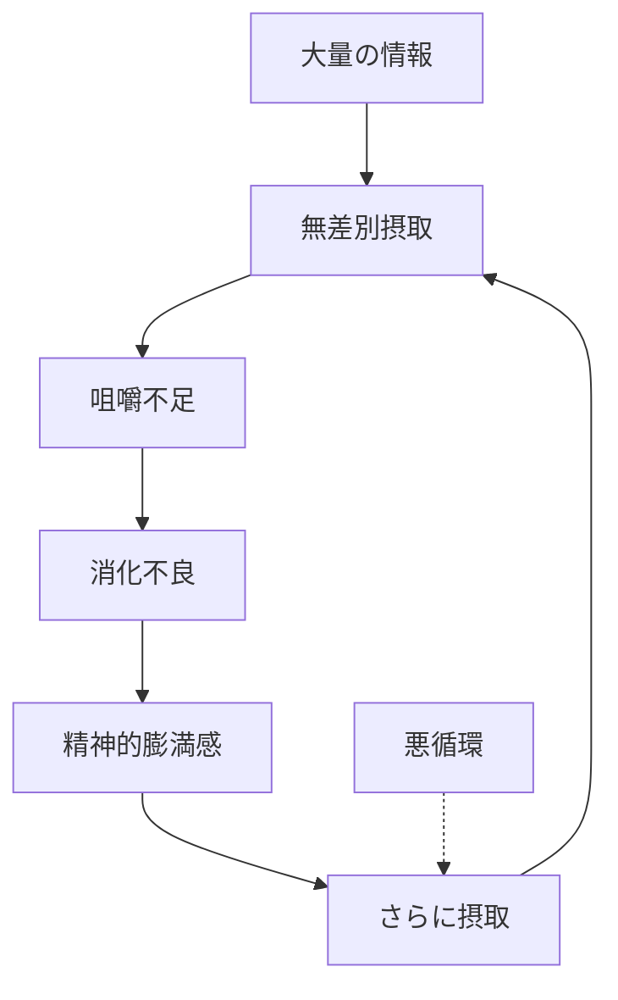
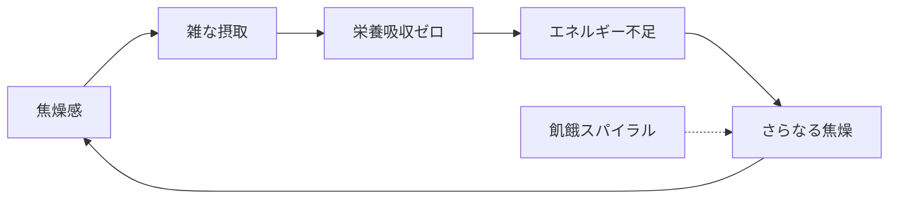
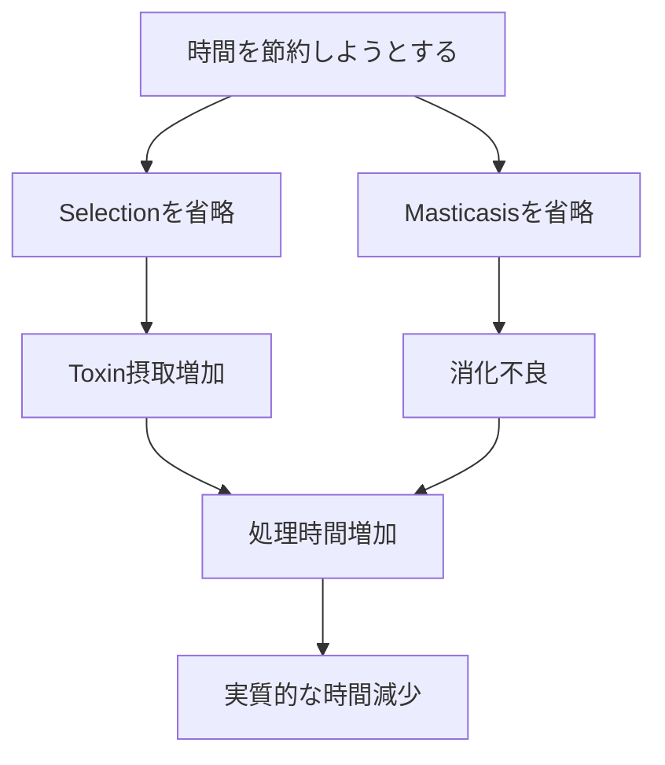
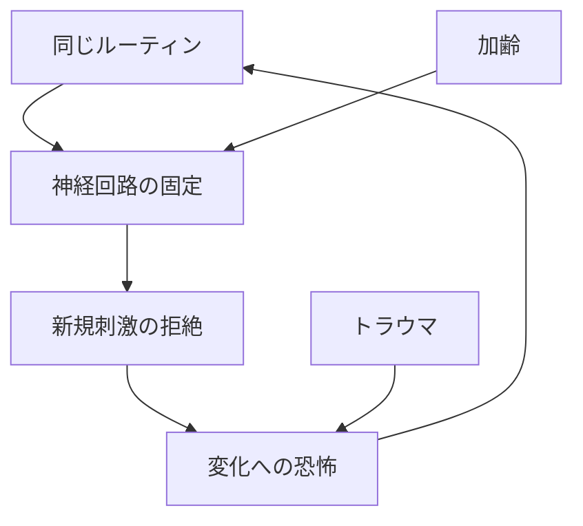
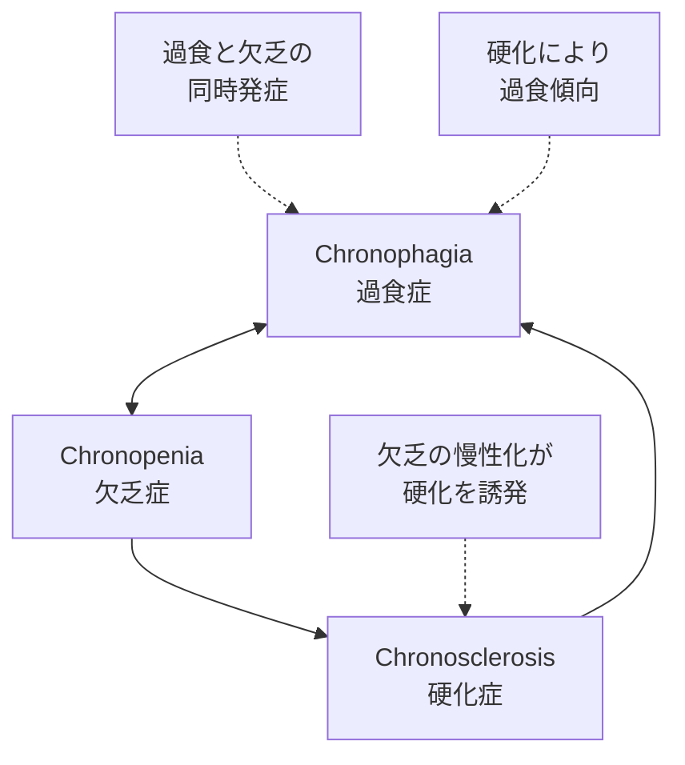
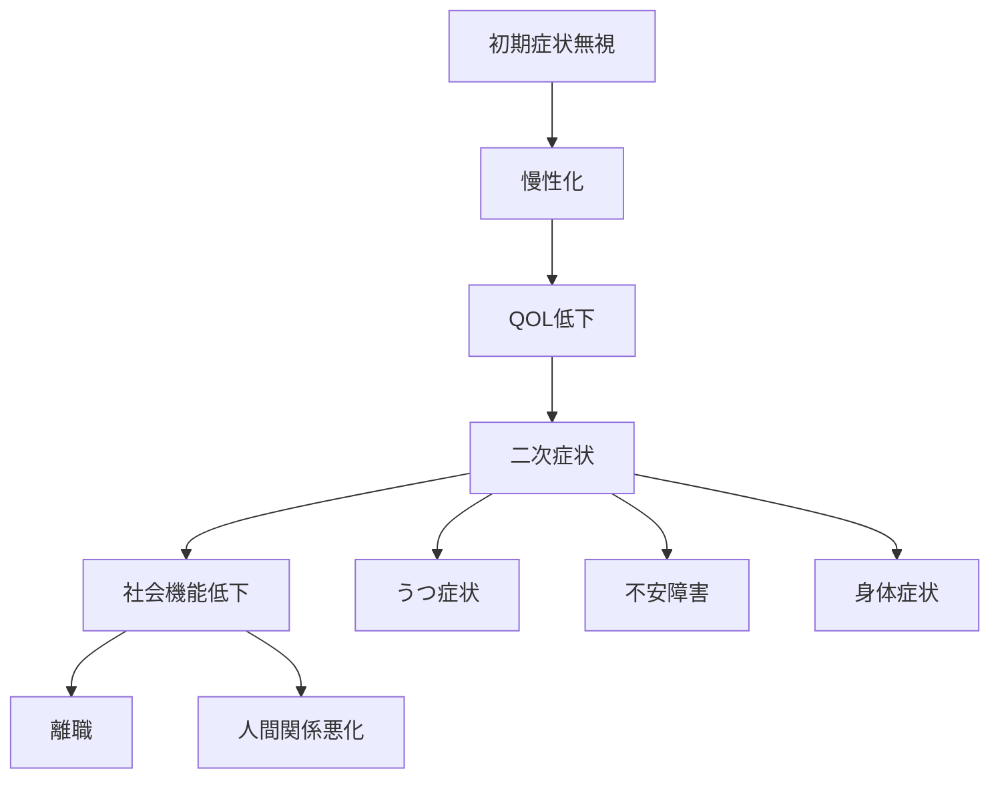

# 第5章：3大時間病理

## 5.1 現代人を蝕む時間の病

食生活の乱れが生活習慣病を引き起こすように、時間の代謝異常は特有の「時間病」を発症させます。これらは単なる「忙しさ」ではなく、れっきとした病理として認識し、適切な治療が必要です。

### 3大時間病の概要

| 病名                  | 読み        | 一言で表すと | 患者数（推定）     |
| :------------------ | :-------- | :----- | :---------- |
| **Chronophagia**    | クロノファジア   | 時間の過食症 | 現代人の70%     |
| **Chronopenia**     | クロノペニア    | 時間の欠乏症 | 現代人の50%     |
| **Chronosclerosis** | クロノスクレロシス | 時間の硬化症 | 年齢に関係なく発症する |

※複数の病理を併発しているケースが多い

## 5.2 Chronophagia（クロノファジア／時間過食症）

### 病理メカニズム

### 症状チェックリスト

以下の項目に3つ以上該当する場合、Chronophagiaの可能性があります：

| ☐ | 症状 |
| :--- | :--- |
| ☐ | ブラウザのタブが常に20個以上開いている |
| ☐ | 「後で読む」リストが100件を超えている |
| ☐ | 動画を1.5倍速以上で視聴することが多い |
| ☐ | 何を学んだか思い出せないのに「勉強した」気がする |
| ☐ | SNSを閉じた直後に何を見たか覚えていない |
| ☐ | 「時間がない」のに無駄な情報を見続けてしまう |
| ☐ | マルチタスクをしていないと不安になる |

### 病期分類

| 病期 | 状態 | 自覚症状 | 他覚症状 |
| :--- | :--- | :--- | :--- |
| **初期** | 軽度の過食 | なんとなく疲れる | 集中時間の低下 |
| **中期** | 慢性的過食 | 常に頭が重い | 会話が散漫 |
| **後期** | 重度の消化不良 | 何も手につかない | 明らかな能率低下 |
| **末期** | 完全な機能不全 | 燃え尽き症候群 | 社会生活困難 |

## 5.3 Chronopenia（クロノペニア／時間欠乏症）

### 病理メカニズム

### 典型的な症状

| 症状カテゴリ | 具体例 |
| :--- | :--- |
| **認知症状** | 「時間がない」が口癖、実際の空き時間を認識できない |
| **身体症状** | 慢性疲労、睡眠を削っても疲れが取れない |
| **行動症状** | 休憩への罪悪感、休日も予定を詰め込む |
| **感情症状** | 常に追われる感覚、達成感の欠如 |

### Chronopeniaの逆説

「急がば回れ」の時間栄養学的な逆説：時間を節約しようとするほど、実際に使える時間が減少する。

## 5.4 Chronosclerosis（クロノスクレロシス／時間硬化症）

### 病理メカニズム

血管が硬化し柔軟性を失うように、時間の使い方が固定化し、新しい体験を受け付けなくなる老化現象。

### 進行段階

| 段階 | 症状 | 行動パターン |
| :--- | :--- | :--- |
| **第1期：軽度硬化** | 新しいことへの億劫さ | 「今のままでいい」 |
| **第2期：中度硬化** | 変化への抵抗 | 「昔はよかった」 |
| **第3期：重度硬化** | 完全なルーティン化 | 同じ店、同じメニュー |
| **第4期：完全硬化** | 時間感覚の喪失 | 1年が一瞬に感じる |

### 硬化度テスト

以下の質問にYes/Noで答えてください：

| 質問 | Yes | No |
| :--- | :--- | :--- |
| この1ヶ月で新しい場所に行きましたか？ | ☐ | ☐ |
| この1週間で初めての体験をしましたか？ | ☐ | ☐ |
| 普段と違うルートで帰宅することがありますか？ | ☐ | ☐ |
| 知らないジャンルの音楽を聴きますか？ | ☐ | ☐ |
| 年下の人から学ぶことがありますか？ | ☐ | ☐ |

**Noが3つ以上：硬化の兆候あり**

## 5.5 併発パターンと相互作用

### よくある併発パターン

### 複合病理の例

| パターン | 状態 | 典型例 |
| :--- | :--- | :--- |
| **過食＋欠乏** | 大量摂取するが栄養にならない | SNS中毒の多忙な人 |
| **欠乏＋硬化** | 忙しさの中で柔軟性を失う | ワーカホリック |
| **硬化＋過食** | 同じコンテンツを大量消費 | 同じ動画の無限ループ |
| **三重苦** | 全ての病理が同時進行 | 重度のバーンアウト予備軍 |

## 5.6 病理の社会的要因

### 時間病を促進する現代の構造

| 要因 | 影響 | 誘発する病理 |
| :--- | :--- | :--- |
| **無限スクロール** | 終わりがない情報提供 | Chronophagia |
| **即レス文化** | 常時対応への圧力 | Chronopenia |
| **効率化至上主義** | 無駄の完全排除 | Chronopenia |
| **アルゴリズム推薦** | 似た情報の反復 | Chronosclerosis |
| **FOMO（見逃し恐怖）** | 全て摂取への衝動 | Chronophagia |

## 5.7 予後と転帰

### 未治療の場合の経過

### 治療による改善可能性

| 病理 | 改善難易度 | 改善期間（目安） | 予後 |
| :--- | :--- | :--- | :--- |
| Chronophagia | 中 | 1-3ヶ月 | 良好 |
| Chronopenia | 高 | 3-6ヶ月 | やや良好 |
| Chronosclerosis | 最高 | 6-12ヶ月 | 個人差大 |

## 章末サマリー

- 3大時間病は現代人の多くが罹患している深刻な病理
- Chronophagia（過食症）：消化できない量を摂取し続ける
- Chronopenia（欠乏症）：忙しさの中で栄養を吸収できない
- Chronosclerosis（硬化症）：同じパターンに固執し柔軟性を失う
- 多くの場合、複数の病理が併発し相互に悪化させる
- 早期発見・早期治療が重要（第6章で栄養素の識別法を、第7章以降で代謝の実践法を、第10章で治療法を解説）

***
