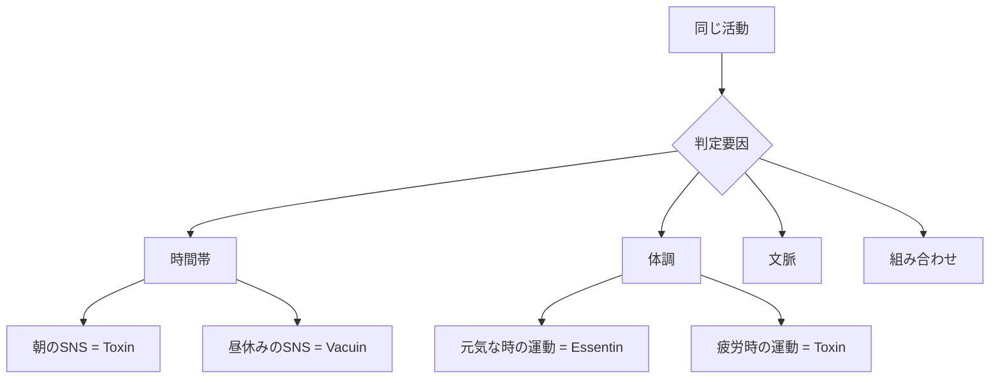
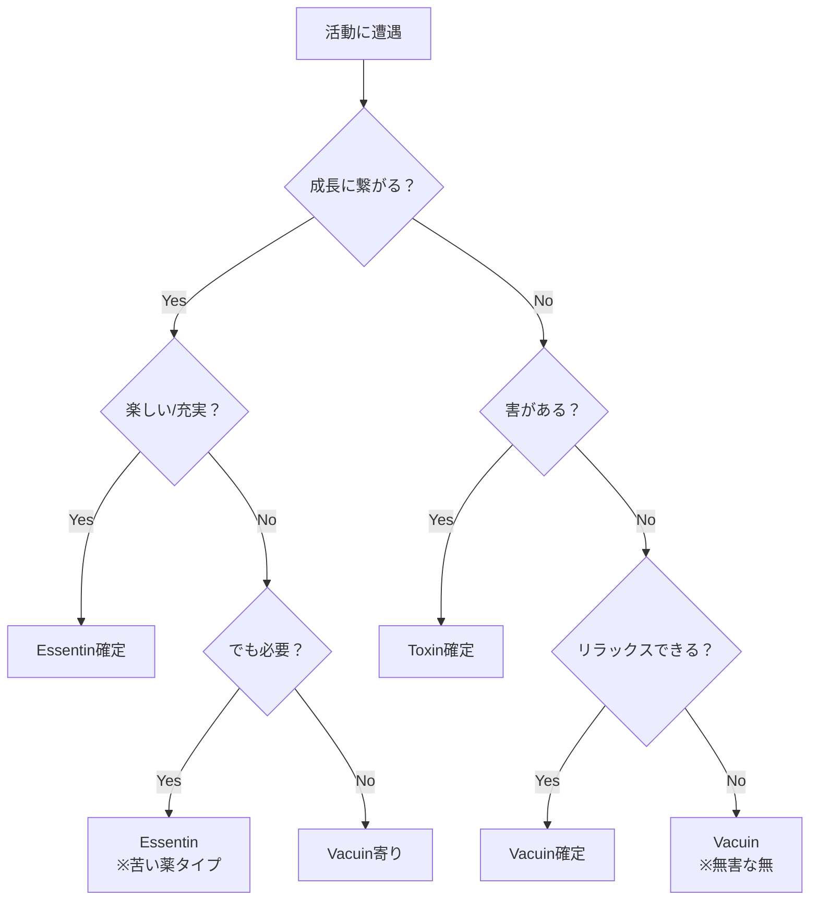
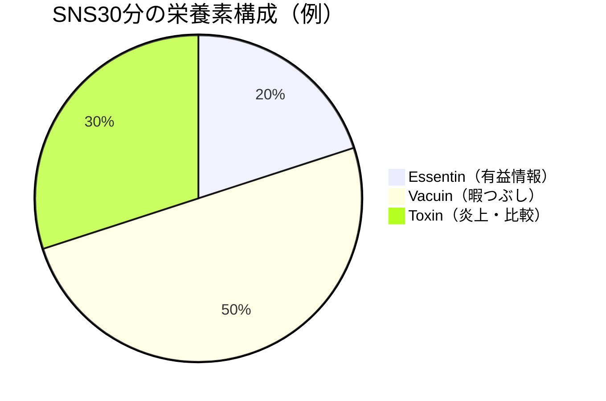
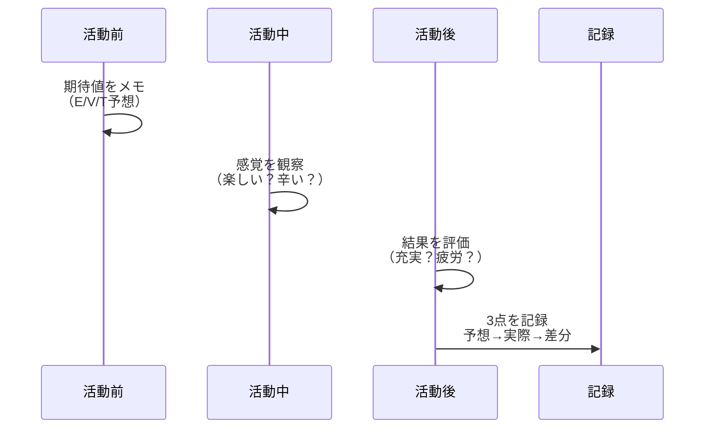
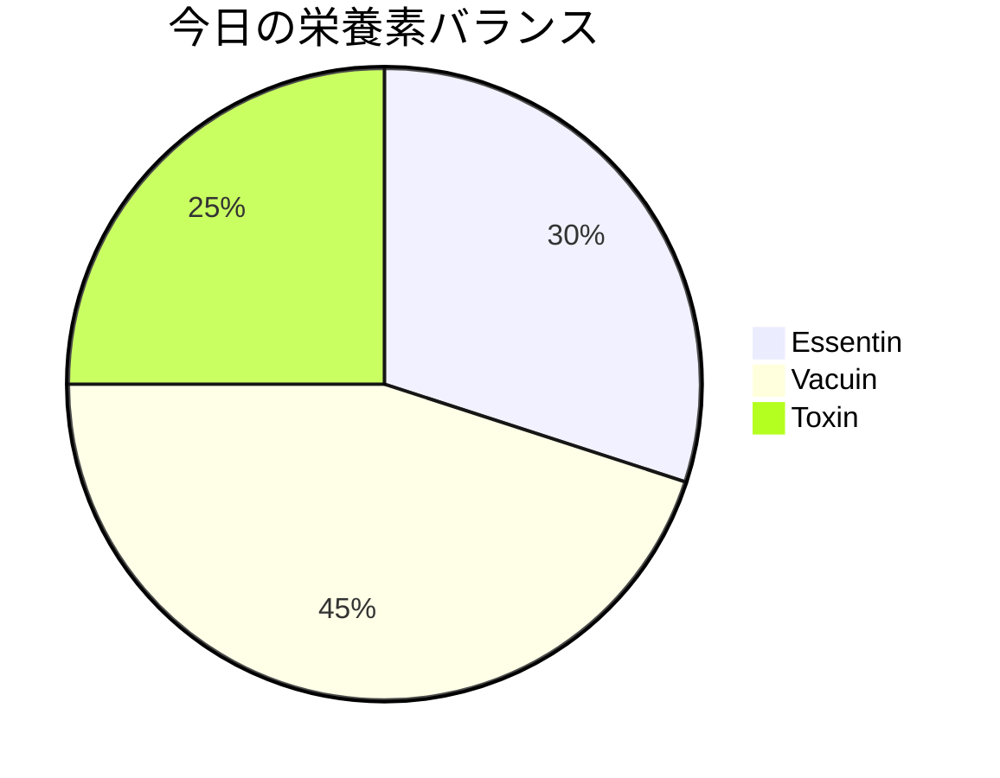

# 第6章：栄養素の見分け方実践

## 6.1 実践の前に：なぜ見分けが難しいのか

理論では3つの栄養素（Essentin/Vacuin/Toxin）を学びましたが、実際の日常では境界が曖昧です。同じ活動でも、状況・タイミング・あなたの状態により栄養素は変化します。

### 栄養素判定の複雑性

## 6.2 栄養素識別の基本フレームワーク

### 3つの判定軸

| 判定軸 | 質問 | Essentin | Vacuin | Toxin |
| :--- | :--- | :--- | :--- | :--- |
| **成長性** | これは自分を成長させるか？ | Yes（確実に） | No（でもOK） | No（むしろ退化） |
| **感情価** | 終わった後どう感じるか？ | 充実・満足 | リラックス・無 | 疲労・後悔 |
| **持続性** | 効果はどれくらい続くか？ | 長期（週〜月） | 短期（時間） | 負の蓄積 |

### 判定フローチャート

## 6.3 日常場面での実践識別

### ケーススタディ：仕事編

| 状況 | 一見すると | 実際の栄養素 | 判定理由 |
| :--- | :--- | :--- | :--- |
| 重要なプレゼン準備 | 大変そう | **Essentin** | スキル向上、達成感大 |
| ルーティンの事務作業 | 退屈 | **Vacuin** | 脳の休息、作業瞑想 |
| 無意味な会議 | 時間の無駄 | **Toxin** or **Vacuin** | 内職可能ならVacuin |
| 建設的なフィードバック | 痛い | **Essentin** | 苦い薬だが成長必須 |
| 上司の愚痴を聞く | 苦痛 | **Toxin** | エネルギー吸収される |

### ケーススタディ：プライベート編

| 状況 | 一見すると | 実際の栄養素 | 判定理由 |
| :--- | :--- | :--- | :--- |
| Netflixドラマ1話 | 娯楽 | **Vacuin** | 適度な刺激と休息 |
| Netflixドラマ5話連続 | まだ娯楽？ | **Toxin** | 過剰摂取で疲労 |
| 友人との深い対話 | 楽しい | **Essentin** | 視野拡大、絆深化 |
| SNSで他人と比較 | 情報収集？ | **Toxin** | 自己肯定感を破壊 |
| 一人でぼーっとする | 無駄？ | **Vacuin** | 脳のデフラグ必須 |

## 6.4 グレーゾーンの扱い方

### 栄養素ハイブリッド型

実際の活動の多くは、複数の栄養素が混在しています：

### ハイブリッド型への対処法

| 対処法 | 説明 | 実践例 |
| :--- | :--- | :--- |
| **分離抽出** | 良い部分だけ取り出す | フォロー整理でToxin源を除去 |
| **時間制限** | Toxin蓄積前に中断 | タイマー25分でSNS強制終了 |
| **意図の明確化** | 目的を持って接触 | 「情報収集」と決めてから開く |
| **代替探索** | より純度の高い栄養源へ | SNS→専門書へシフト |

## 6.5 個人カスタマイズシート作成

### あなただけの栄養素マップ

以下のテンプレートを埋めて、個人用の判定基準を作ります：

| 活動     | 朝        | 昼      | 夜        | 条件・備考   |
| :----- | :------- | :----- | :------- | :------ |
| 例：読書   | Essentin | Vacuin | Essentin | 昼は集中力低下 |
| 運動     |          |        |          |         |
| SNS    |          |        |          |         |
| 仕事     |          |        |          |         |
| 動画視聴   |          |        |          |         |
| 友人との会話 |          |        |          |         |

### 自己観察の記録方法

## 6.6 栄養素の変化を見抜く

### 栄養素が変質するサイン

| 元の栄養素 | 変化後 | 変質のサイン |
| :--- | :--- | :--- |
| Essentin → Toxin | 学習が苦行に | 頭に入らない、イライラ増加 |
| Vacuin → Toxin | 休息が疲労に | 「もういいや」という感覚 |
| Essentin → Vacuin | 成長が停滞 | マンネリ化、作業化 |
| Toxin → Vacuin | 毒が薄まる | 慣れて気にならなくなる（危険） |

### リアルタイム判定術

活動中に以下を自問し、栄養素の変質を察知：

1. **5分ごとのチェック**
   - 「今、これは栄養になっているか？」

2. **身体感覚の確認**
   - 肩の力、呼吸の深さ、目の疲れ

3. **感情温度の測定**
   - ワクワク（Essentin）／まったり（Vacuin）／イライラ（Toxin）

## 6.7 実践演習：今日の24時間を分析

### 栄養素ログシート

昨日または今日の活動を振り返り、栄養素を判定してみましょう：

| 時間帯 | 活動内容 | 判定 | Caloria | メモ |
| :--- | :--- | :--- | :--- | :--- |
| 6:00-7:00 |  | E/V/T | 高/中/低 |  |
| 7:00-8:00 |  | E/V/T | 高/中/低 |  |
| 8:00-9:00 |  | E/V/T | 高/中/低 |  |
| （続く） |  | E/V/T | 高/中/低 |  |

### 分析結果の可視化

理想は E:40-50%、V:40-50%、T:10%以下

## 6.8 識別力を高めるトレーニング

### 週次トレーニングメニュー

| 曜日 | トレーニング | 目的 |
| :--- | :--- | :--- |
| 月 | 新しい活動を1つ試す | 未知の栄養素を体験 |
| 火 | Toxinを1つ特定し排除 | 毒素源の認識力向上 |
| 水 | Vacuinを意図的に2回摂取 | 休息の効果を体感 |
| 木 | Essentin濃度を測定 | 質の違いを知る |
| 金 | ハイブリッド型を分解 | 分離能力の向上 |
| 土 | 他人の時間使いを観察 | 客観的視点の獲得 |
| 日 | 週の栄養バランスを集計 | 全体最適の意識 |

## 章末サマリー

- 栄養素の識別は状況・時間帯・体調により変化する動的なもの
- 成長性・感情価・持続性の3軸で判定する
- 多くの活動は複数の栄養素が混在するハイブリッド型
- 個人カスタマイズシートで自分だけの基準を作る
- 日々の観察と記録により識別力は確実に向上する

***
