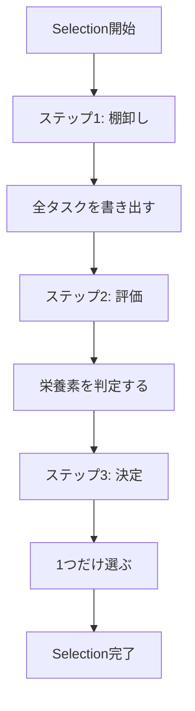
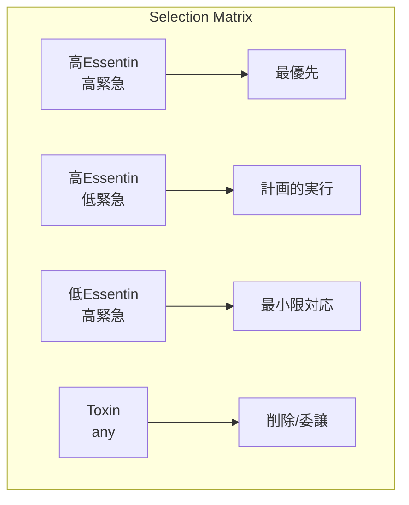
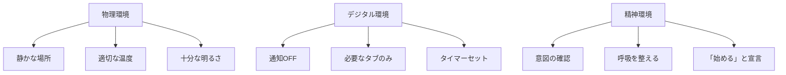
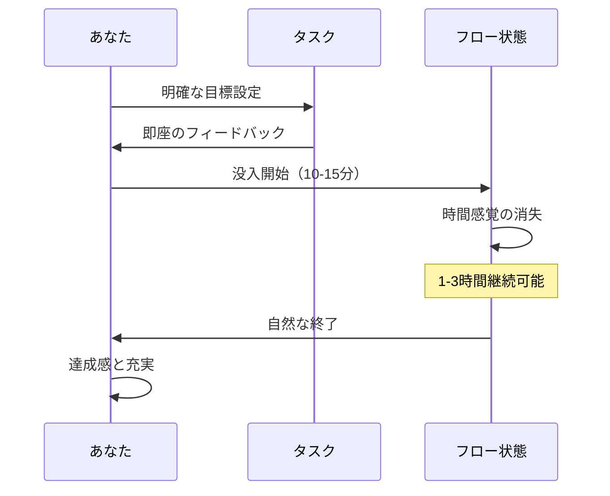
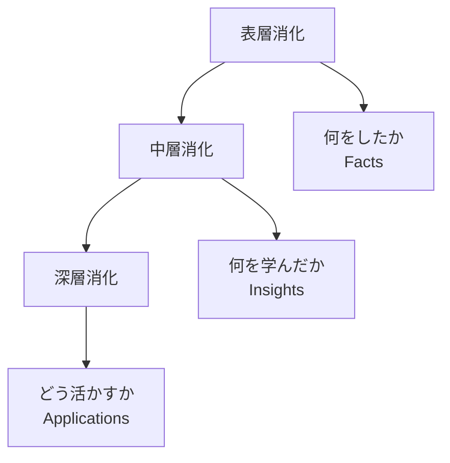
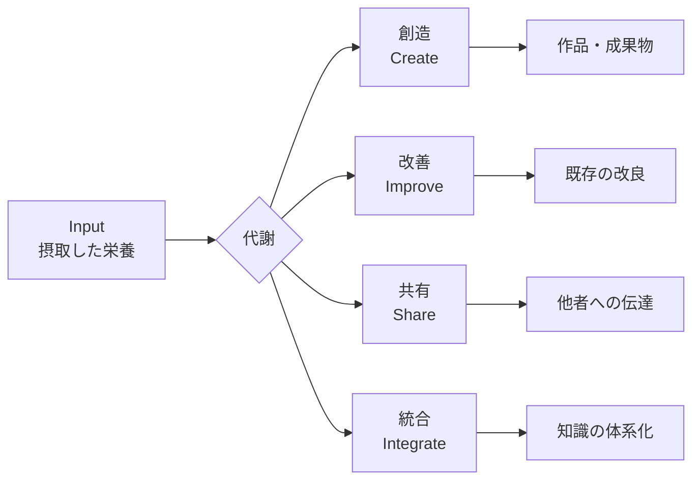

# 第7章：標準代謝の実行手順

## 7.1 標準代謝ルートの実践準備

4段階の標準代謝（Selection→Masticasis→Digestis→Metabolysis）を日常で実行するための、具体的な手順とテクニックを解説します。

### 実行前チェックリスト

| ☐   | 準備項目         | 理由                         |
| :-- | :----------- | :------------------------- |
| ☐   | 2〜4時間程度の時間確保 | 全工程を中断なく実行するため（内容の深度により変動） |
| ☐   | デバイスの通知OFF   | Masticasisの深度を保つため         |
| ☐   | 水とメモの用意      | 身体維持と思考の外部化                |
| ☐   | 実行意図の明確化     | 「なぜ今これをやるか」を言語化            |

## 7.2 Stage 1: Selection（選別）の実践

### Selection の3ステップ



### ステップ1：棚卸し（Inventory）

**実行時間：5-10分**

| 手順 | 具体的アクション | ツール |
| :--- | :--- | :--- |
| 1. 脳内ダンプ | 頭の中の全タスクを吐き出す | 白紙/付箋 |
| 2. カテゴリ分け | 仕事/個人/学習/その他 | 4色ペン |
| 3. 期限マーキング | 今日/今週/今月/いつか | 記号付け |

### ステップ2：評価（Evaluation）

**実行時間：5分**

栄養素マトリクスで各タスクを配置：



### ステップ3：決定（Decision）

**実行時間：30秒**

決定の3原則：
1. **迷ったらEssentin優先**
2. **2つで迷ったら難しい方**
3. **それでも迷ったら直感**

### Selection の失敗パターンと対策

| 失敗パターン | 症状 | 対策 |
| :--- | :--- | :--- |
| 選択麻痺 | 15分以上悩む | タイマー10分で強制決定 |
| 全部重要病 | 優先順位がつけられない | 「1つしかできないなら？」と自問 |
| 気分選択 | 楽な方を選んでしまう | Essentinスコアを数値化（1-10） |

## 7.3 Stage 2: Masticasis（深層咀嚼）の実践

### Masticasis の環境設定



### 深層咀嚼の技法

**基本型：ポモドーロ式Masticasis**

| フェーズ | 時間 | 行動 | 意識 |
| :--- | :--- | :--- | :--- |
| 没入 | 25分 | 完全集中 | 他の一切を忘れる |
| 小休憩 | 5分 | 立ち上がる | 脳を完全に休める |
| 没入 | 25分 | 再集中 | より深いレベルへ |
| 大休憩 | 15分 | 軽い運動 | 血流を促進 |

**上級型：フロー式Masticasis**



### Masticasis を深める5つのテクニック

| テクニック | 方法 | 効果 |
| :--- | :--- | :--- |
| **単一焦点法** | 画面に1つのウィンドウのみ | 視覚的ノイズ削減 |
| **BGM固定法** | 同じ曲をループ再生 | 意識の安定化 |
| **宣言法** | 「今から○○する」と声に出す | 意識の明確化 |
| **締切法** | 人工的デッドラインを設定 | 集中力の増幅 |
| **報酬法** | 完了後の褒美を決めておく | モチベーション維持 |

## 7.4 Stage 3: Digestis（完全消化）の実践

### Digestis の3層処理



### 消化促進テンプレート

**実行時間：10-30分**

以下の質問に答えることで、体験を知識に変換：

| レベル | 質問 | 記入例 |
| :--- | :--- | :--- |
| **表層** | 何をしましたか？ | Pythonの基礎を2時間学習した |
| **中層** | 新しく理解したことは？ | 関数とは処理をまとめる箱だと分かった |
| | 難しかった点は？ | 引数と戻り値の関係性 |
| | 面白かった点は？ | 同じ処理を使い回せる効率性 |
| **深層** | これをどう使いますか？ | 明日の業務自動化スクリプトに適用 |
| | 次に学ぶべきことは？ | クラスとオブジェクト指向 |

### 消化を助ける外部化技法

| 技法 | 実践方法 | 適した内容 |
| :--- | :--- | :--- |
| **マインドマップ** | 中心から放射状に展開 | 概念の関係性理解 |
| **3行要約** | 学んだことを3行で表現 | エッセンスの抽出 |
| **他者説明** | 誰かに説明するつもりで書く | 理解度の確認 |
| **具体例作成** | 自分の状況に当てはめる | 実践への橋渡し |

## 7.5 Stage 4: Metabolysis（活動代謝）の実践

### Metabolysis の発現形態



### 代謝出力の具体例

| 摂取内容 | 代謝形態 | 出力例 |
| :--- | :--- | :--- |
| プログラミング学習 | 創造 | 自作アプリ開発 |
| ビジネス書読書 | 改善 | 業務フロー最適化 |
| 料理動画視聴 | 実践 | 新レシピで夕食作成 |
| 哲学書精読 | 共有 | ブログ記事執筆 |
| 複数分野の学習 | 統合 | 独自理論の構築 |

### 代謝を加速する触媒

| 触媒 | 使い方 | 効果 |
| :--- | :--- | :--- |
| **締切設定** | 公開日を先に決める | 強制的な出力 |
| **仲間との約束** | 成果を見せる約束 | 社会的圧力 |
| **小さく始める** | 完璧を求めない | 初動の軽さ |
| **テンプレート活用** | 型から始める | 構造の借用 |

## 7.6 標準代謝の実行記録

### デイリーログ・テンプレート

```markdown
## [日付] 標準代謝ログ

### Selection（所要時間：＿分）
- 選んだタスク：
- 選択理由：
- 捨てたもの：

### Masticasis（所要時間：＿分）
- 集中深度（1-10）：
- 中断回数：
- フロー到達：Yes/No

### Digestis（所要時間：＿分）
- 主な学び：
- 次への課題：

### Metabolysis（所要時間：＿分）
- 出力形態：
- 成果物：
- 満足度（1-10）：

### 全体振り返り
- うまくいった点：
- 改善点：
- 明日への申し送り：
```

## 7.7 トラブルシューティング

### よくある問題と解決法

| 段階 | 問題 | 症状 | 解決法 |
| :--- | :--- | :--- | :--- |
| Selection | 決められない | 30分経っても選べない | コイントス or 最初に目についたもの |
| Masticasis | 集中できない | 5分で別のことを考える | 環境を変える、立って作業 |
| Digestis | 消化不良 | 何を学んだか言えない | もう一度15分だけMasticasis |
| Metabolysis | 出力できない | 手が動かない | 最低品質でいいから5分だけ作る |

## 章末サマリー

- Selection は10分以内に1つを選ぶ勇気
- Masticasis はシングルタスクでの深い没入
- Digestis は3層（事実・洞察・応用）での消化
- Metabolysis は不完全でもいいから出力する
- 4段階を記録し、日々改善することが上達への道

***
