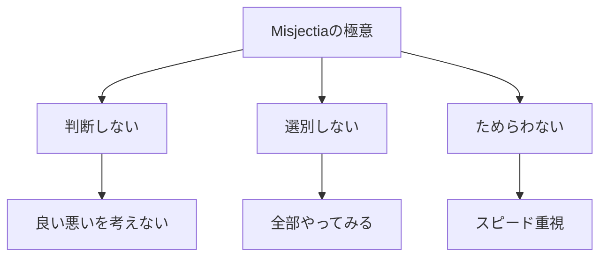
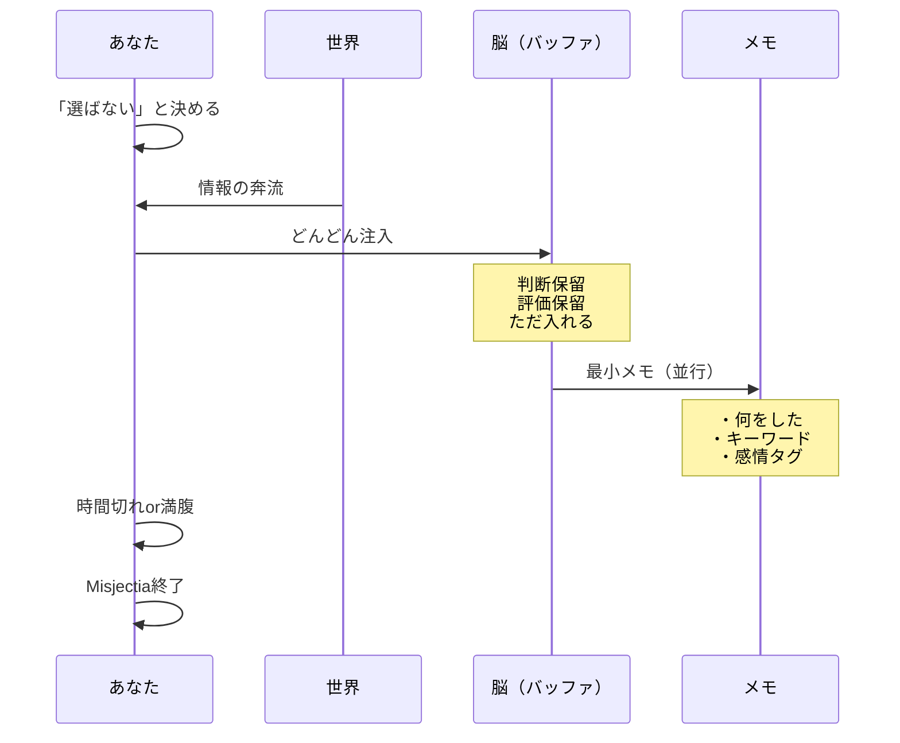
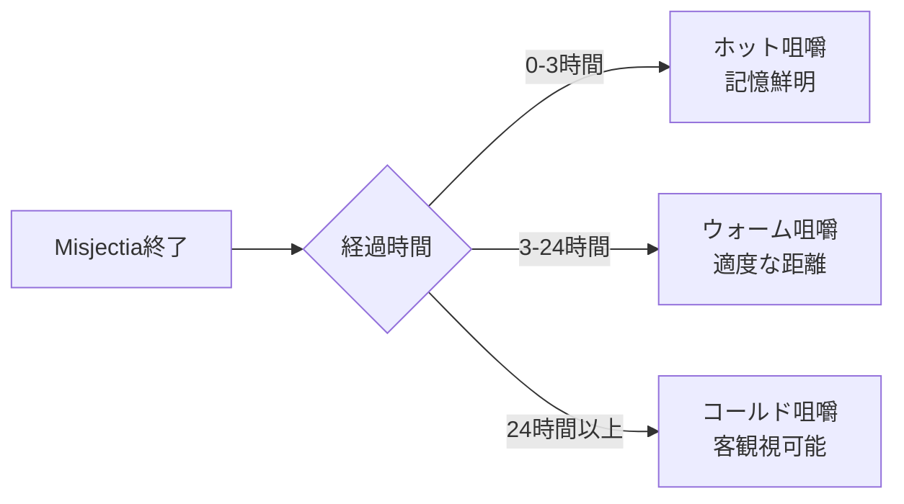
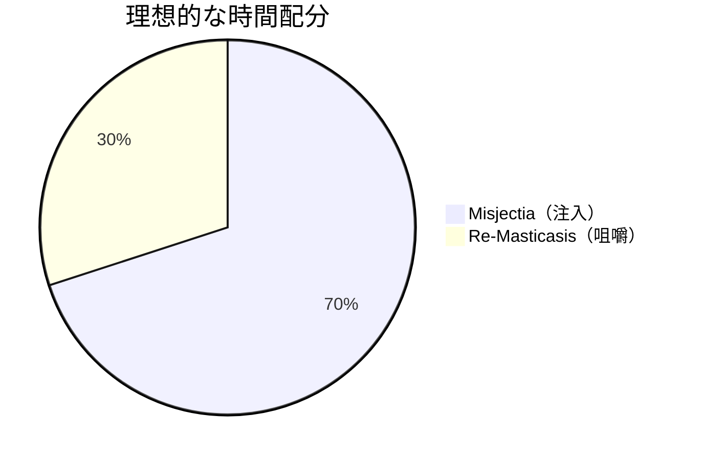
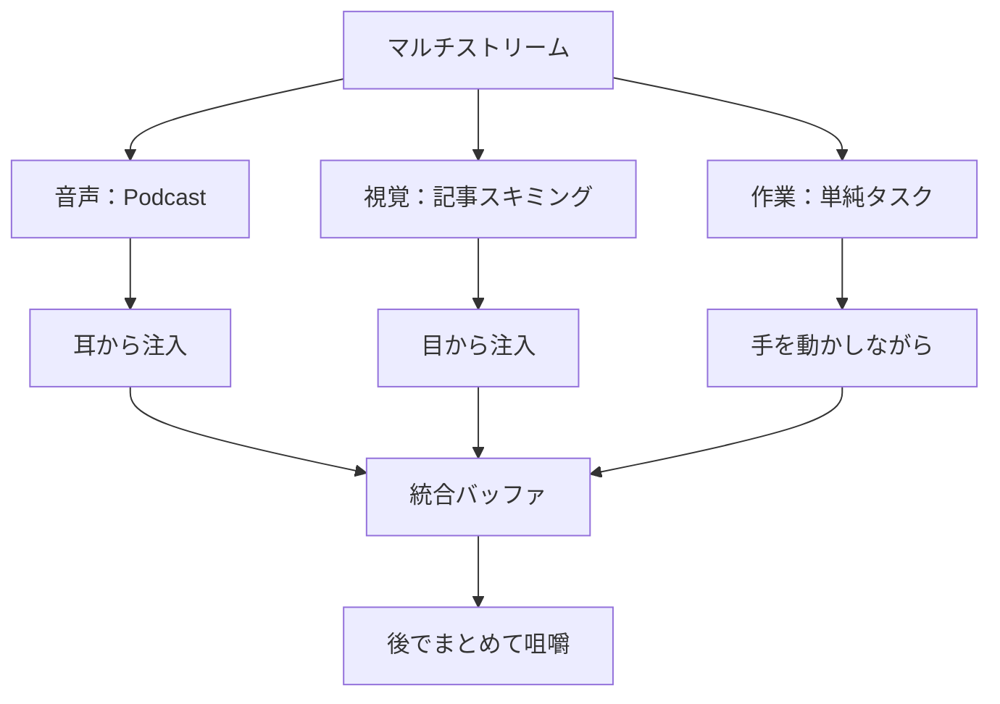
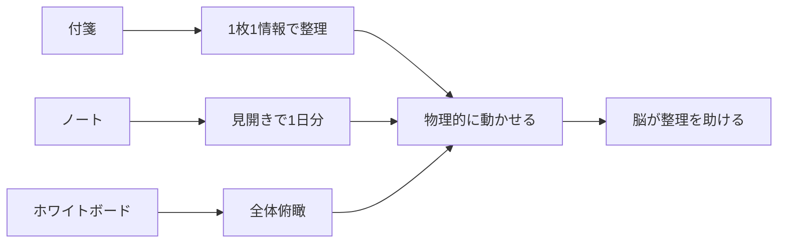

# 第8章：反芻代謝の実行手順

## 8.1 反芻代謝ルートの本質

反芻代謝（Misjectia→Re-Masticasis）は、牛が草を一度飲み込んで後から噛み直すように、情報を一旦すべて取り込んでから選別・消化する手法です。現代の情報過多時代に最適化された、実践的な代謝ルートです。

### 反芻代謝が適している人

| タイプ | 特徴 | 反芻代謝との相性 |
| :--- | :--- | :--- |
| 探索型 | 新しいものが好き、好奇心旺盛 | ★★★★★ |
| 多動型 | じっとしていられない、同時並行が得意 | ★★★★★ |
| 完璧主義型 | 選ぶのに時間がかかる | ★★★★☆ |
| 直感型 | 考えるより動く | ★★★★☆ |
| 計画型 | 事前に決めたい | ★★☆☆☆ |

## 8.2 Stage 1: Misjectia（雑多注入）の実践

### Misjectia の心構え



### 3つの注入モード

| モード | 時間 | スタイル | 適した場面 |
| :--- | :--- | :--- | :--- |
| **スプリント注入** | 15-30分 | 超高速で大量摂取 | 朝のニュースチェック |
| **フロー注入** | 1-3時間 | 流れに任せて漂流 | 休日の探索 |
| **パラレル注入** | 終日 | 複数を同時進行 | マルチタスク日 |

### Misjectia の実行手順



### リアルタイムメモの技法

**重要：メモは「記憶のアンカー」であり、詳細は不要**

| メモ形式 | 記入例 | 利点 |
| :--- | :--- | :--- |
| **行動ログ** | `10:15 YouTube 料理動画3本` | 時系列が明確 |
| **キーワード羅列** | `Python 関数 引数 エラー処理` | 検索しやすい |
| **感情タグ** | `😀面白い記事 😴退屈な会議 😡イラつくメール` | 感情で思い出せる |
| **ハイブリッド** | `10:15 😀 YouTube料理→パスタ作りたい` | 全要素カバー |

## 8.3 Stage 2: Re-Masticasis（再咀嚼）の実践

### Re-Masticasis の黄金時間



### 再咀嚼の5ステップ・プロセス

| ステップ | 行動 | 時間 | アウトプット |
| :--- | :--- | :--- | :--- |
| **1. 召喚** | メモを見て記憶を呼び戻す | 3分 | 体験の再現 |
| **2. 分類** | E/V/Tに仕分ける | 5分 | 栄養素マップ |
| **3. 抽出** | Essentinを深堀り | 10分 | 学びリスト |
| **4. 廃棄** | Toxinを削除・忘却 | 2分 | ゴミ箱行き |
| **5. 保存** | 価値あるものを整理保存 | 5分 | 知識ベース |

### Re-Masticasis 実践ワークシート

```markdown
## [日付] Re-Masticasis記録

### 1. 召喚（何をやったか思い出す）
- 時間帯：
- 主な活動：
- 印象的だったこと：

### 2. 分類（栄養素判定）
#### Essentin（成長につながった）
- 
- 

#### Vacuin（休息になった）
- 
- 

#### Toxin（有害だった）
- 
- 

### 3. 抽出（Essentinから学びを引き出す）
- 新しい知識：
- 得たスキル：
- 次に活かせること：

### 4. 廃棄（Toxinの処理）
- 削除したもの：
- 今後避けるもの：

### 5. 保存（知識ベースへ）
- 保存先：
- タグ：
- 関連付け：
```

## 8.4 Misjectia→Re-Masticasisの連携技

### タイミング戦略

| パターン | Misjectia | Re-Masticasis | 効果 |
| :--- | :--- | :--- | :--- |
| **即席型** | 30分注入 | 即座に10分咀嚼 | 記憶の定着 |
| **一日型** | 日中注入 | 寝る前に咀嚼 | 睡眠学習効果 |
| **週末型** | 平日注入 | 週末にまとめて咀嚼 | 俯瞰的理解 |
| **月次型** | 1ヶ月注入 | 月末に総咀嚼 | パターン発見 |

### 注入量と咀嚼時間の黄金比



**7:3の法則**：注入に70%、咀嚼に30%の時間を配分すると最も効率的

## 8.5 反芻代謝の応用テクニック

### マルチストリーム注入法

複数の情報源を同時に浴びる上級技法：



### バッファ・オーバーフロー対策

| 症状 | 原因 | 対策 |
| :--- | :--- | :--- |
| 頭が真っ白 | 注入過多 | 即座にLethalyze発動 |
| 何も覚えてない | メモ不足 | 5分ごとに1行メモ |
| 混乱・錯綜 | 分野の混在 | カテゴリ別に時間分割 |
| 疲労感 | Toxin過多 | Vacuinを挟む |

## 8.6 Re-Masticasisを効率化するツール

### デジタルツール活用法

| ツール         | 用途       | 使い方のコツ          |
| :---------- | :------- | :-------------- |
| **メモアプリ**   | リアルタイムログ | 音声入力で高速化        |
| **マインドマップ** | 関連性の可視化  | 中心にその日のテーマ      |
| **カレンダー**   | 時系列の確認   | 何時に何をしたか        |
| **タグ管理**    | 後から検索    | essentin toxin等 |

### アナログツールの威力



## 8.7 反芻代謝の成功指標

### KPI（重要業績評価指標）

| 指標 | 計測方法 | 目標値 |
| :--- | :--- | :--- |
| **咀嚼率** | Re-Masticasis実施日÷Misjectia実施日 | 80%以上 |
| **Essentin抽出率** | 抽出した学び÷注入した情報 | 20%以上 |
| **Toxin廃棄率** | 廃棄したToxin÷識別したToxin | 90%以上 |
| **サイクル時間** | Misjectia→Re-Masticasisの時間 | 24時間以内 |

### 週次振り返りテンプレート

```markdown
## 週次反芻代謝レビュー

### 定量評価
- Misjectia回数：＿回
- Re-Masticasis回数：＿回
- 咀嚼率：＿％

### 定性評価
- 最も価値があった注入：
- 最も深い咀嚼ができた内容：
- 避けるべきだったToxin：

### 来週への改善
- 注入する分野：
- 咀嚼のタイミング：
- メモの取り方：
```

## 章末サマリー

- Misjectiaは「選ばない勇気」で全てを浴びる
- メモは最小限、ただし必須（記憶のアンカー）
- Re-Masticasisは24時間以内が黄金時間
- 注入7：咀嚼3の時間配分が理想
- 成功の鍵は咀嚼率80%以上の維持

***
