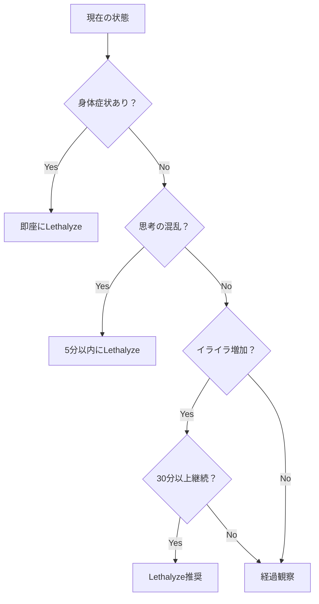
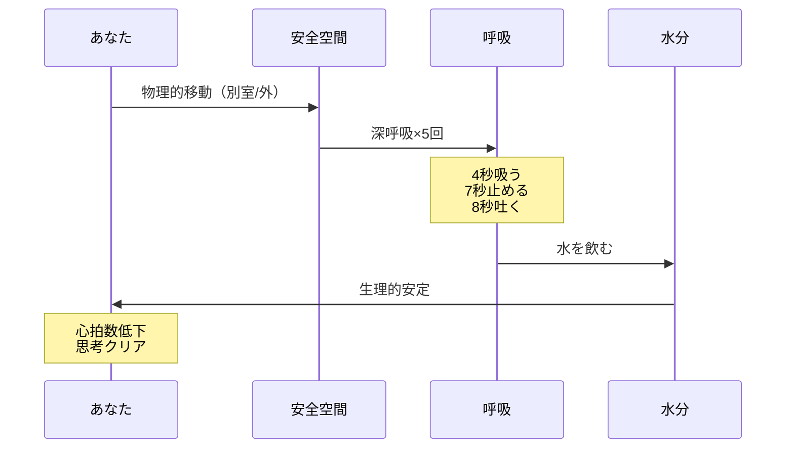
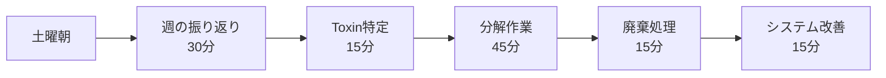
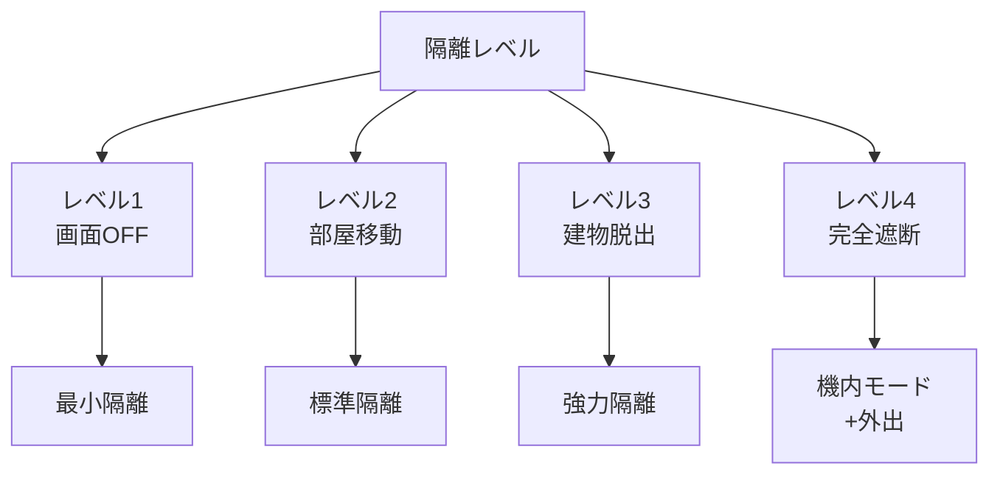
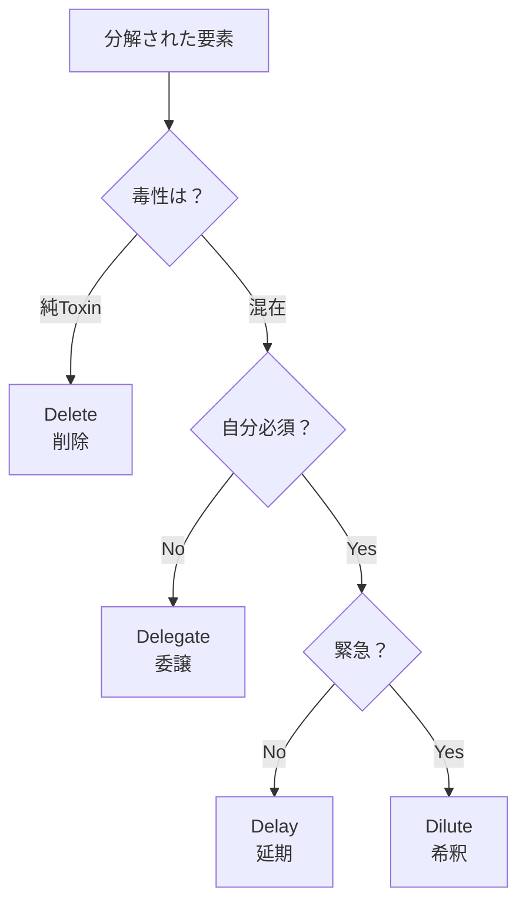
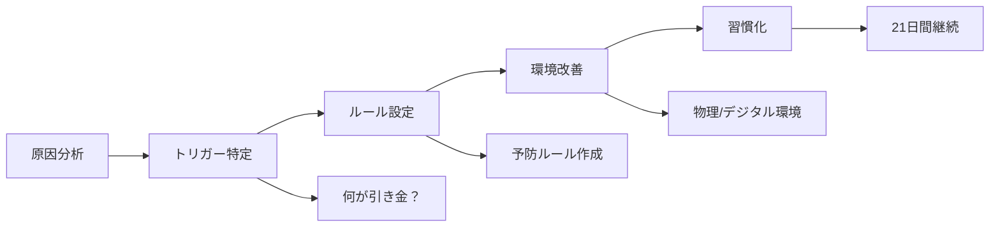
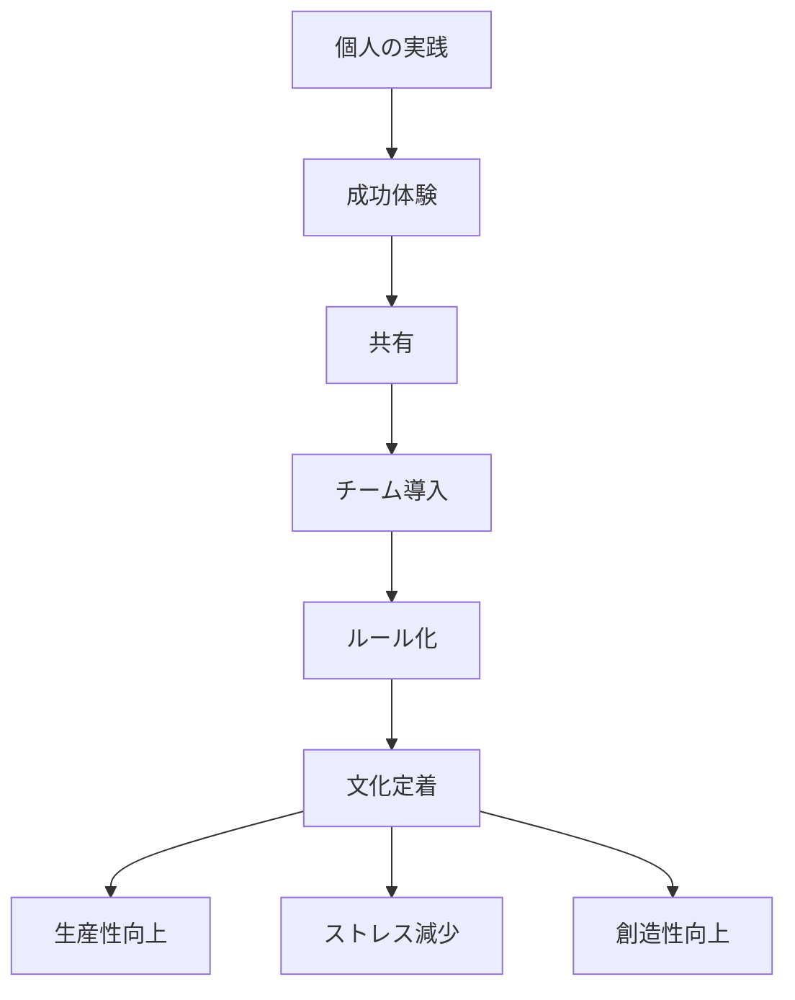

# 第9章：Lethalyzeの発動方法

## 9.1 緊急処置を躊躇しない

Lethalyze（毒性分解）は、あなたの精神的生命を守る最後の砦です。「まだ大丈夫」と思った時は、すでに危険域に入っています。早期発動が、被害を最小限に抑えます。

### 発動判定フローチャート



## 9.2 即座発動型Lethalyze（緊急モード）

### 10秒プロトコル

致死量に達した瞬間の超高速処置：

| 秒数 | アクション | 具体的動作 |
| :--- | :--- | :--- |
| 0-3秒 | **STOP** | 両手を机から離す、画面から目を逸らす |
| 4-6秒 | **STAND** | 立ち上がる、身体を動かす |
| 7-10秒 | **SEPARATE** | デバイスを置いて部屋を出る |

### 緊急離脱後の安定化



## 9.3 計画発動型Lethalyze（予防モード）

### デイリー・ミニLethalyze

毎日の小さな毒抜きで、致死量到達を防ぐ：

| 時間帯 | トリガー | 実行内容 | 所要時間 |
| :--- | :--- | :--- | :--- |
| **朝** | 起床後 | 昨日の残留Toxinを確認・廃棄 | 3分 |
| **昼** | 昼食後 | 午前中のToxinを書き出し | 5分 |
| **夕** | 仕事終了時 | 仕事のToxinを職場に置いていく | 5分 |
| **夜** | 就寝前 | 今日のToxin総清算 | 10分 |

### ウィークリー・フルLethalyze

週末の本格的な解毒作業：



## 9.4 Lethalyze実行の5段階詳細

### Stage 1: STOP（即座停止）

| 状況 | 停止方法 | NG行動 |
| :--- | :--- | :--- |
| PC作業中 | Ctrl+S → 画面ロック | 「キリのいいところまで」 |
| スマホ使用中 | 電源ボタン → 机に置く | 「最後にこれだけ見る」 |
| 会議中 | 「少し失礼します」→ 退室 | 我慢して座り続ける |
| 議論中 | 「一旦整理させて」→ 中断 | 感情的に反論 |

### Stage 2: ISOLATE（物理的隔離）



### Stage 3: BREATHE（呼吸と安定）

**4-7-8呼吸法の医学的効果：**

| フェーズ | 秒数 | 効果 | 生理的変化 |
| :--- | :--- | :--- | :--- |
| 吸気 | 4秒 | 酸素供給 | 血中酸素濃度上昇 |
| 保持 | 7秒 | 圧力調整 | 迷走神経刺激 |
| 呼気 | 8秒 | 毒素排出 | 副交感神経優位 |

5サイクル実施で心拍数が平均15%低下

### Stage 4: DECOMPOSE（分解）

**致死量の分解マトリクス：**

大きな塊を、処理可能なサイズに切り分ける

| 分解軸 | 質問 | 分類 |
| :--- | :--- | :--- |
| **時間軸** | いつまでに必要？ | 今/今日/今週/いつか |
| **重要度軸** | 本当に重要？ | 最重要/重要/普通/不要 |
| **可能性軸** | 自分にできる？ | 可能/支援要/委譲可/不可能 |
| **毒性軸** | これは毒？ | 純Toxin/混在/Vacuin/Essentin |

実際の分解作業シート：

```markdown
## Lethalyze分解シート

### 巨大な塊：[案件名]

#### 時間軸分解
- 今すぐ：
- 今日中：
- 今週中：
- いつか：

#### 重要度分解
- 最重要（死活問題）：
- 重要（影響大）：
- 普通（あれば良い）：
- 不要（なくても困らない）：

#### 可能性分解
- 自力可能：
- 支援必要：
- 委譲可能：
- 不可能：

#### 毒性分解
- 純粋なToxin（削除）：
- 混在（要分離）：
- Vacuin（後回し）：
- Essentin（優先）：
```

### Stage 5: NEUTRALIZE（中和）

**4D戦略の実行判定：**



## 9.5 Lethalyze後のリカバリー

### 段階的回復プロトコル

| Phase | 時間 | 活動 | 目的 |
| :--- | :--- | :--- | :--- |
| **Phase 1** | 0-15分 | 完全休息 | 神経系の鎮静 |
| **Phase 2** | 15-30分 | 軽いVacuin摂取 | 緩やかな再起動 |
| **Phase 3** | 30-60分 | 軽作業 | 通常モードへの移行 |
| **Phase 4** | 60分以降 | 通常活動（軽め） | 完全復帰 |

### 再発防止の仕組み作り



## 9.6 Lethalyzeトレーニング

### 練習用シミュレーション

実際の緊急事態の前に、練習しておく：

| 練習レベル | シナリオ | 実行内容 |
| :--- | :--- | :--- |
| **初級** | 軽いイライラを感じた時 | 10秒プロトコル実行 |
| **中級** | 情報過多を感じた時 | フル5段階を15分で |
| **上級** | 平常時に予防的に | 週次Lethalyzeの習慣化 |

### 発動記録テンプレート

```markdown
## Lethalyze発動記録

### 基本情報
- 日時：
- 発動レベル：軽/中/重/緊急
- トリガー：

### 実行内容
- [ ] STOP（　秒）
- [ ] ISOLATE（レベル　）
- [ ] BREATHE（　サイクル）
- [ ] DECOMPOSE（　分）
- [ ] NEUTRALIZE（　個処理）

### 結果
- 処理前の状態（1-10）：
- 処理後の状態（1-10）：
- 削除したToxin：
- 学んだこと：

### 次回への改善
- 
```

## 9.7 チーム・組織でのLethalyze

### 集団Lethalyzeの発動

チーム全体が致死量に達した時の対処：

| サイン | 対処 | リーダーの役割 |
| :--- | :--- | :--- |
| 会議が堂々巡り | 「5分休憩」宣言 | 強制的な中断 |
| 全員イライラ | 「換気タイム」 | 物理的な環境変更 |
| 締切パニック | 「優先順位会議」 | 冷静な仕分け |

### Lethalyze文化の醸成



## 章末サマリー

- Lethalyzeは「まだ大丈夫」と思った時点で発動する
- 10秒プロトコルで緊急離脱を習慣化
- STOP→ISOLATE→BREATHE→DECOMPOSE→NEUTRALIZEの5段階
- 日次・週次の予防的Lethalyzeで致死量到達を防ぐ
- 練習とログにより、発動スキルは確実に向上する

***
